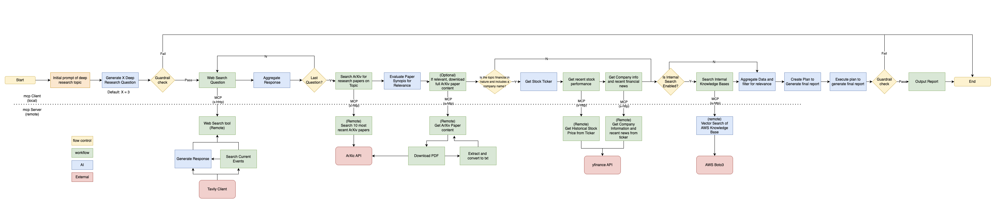
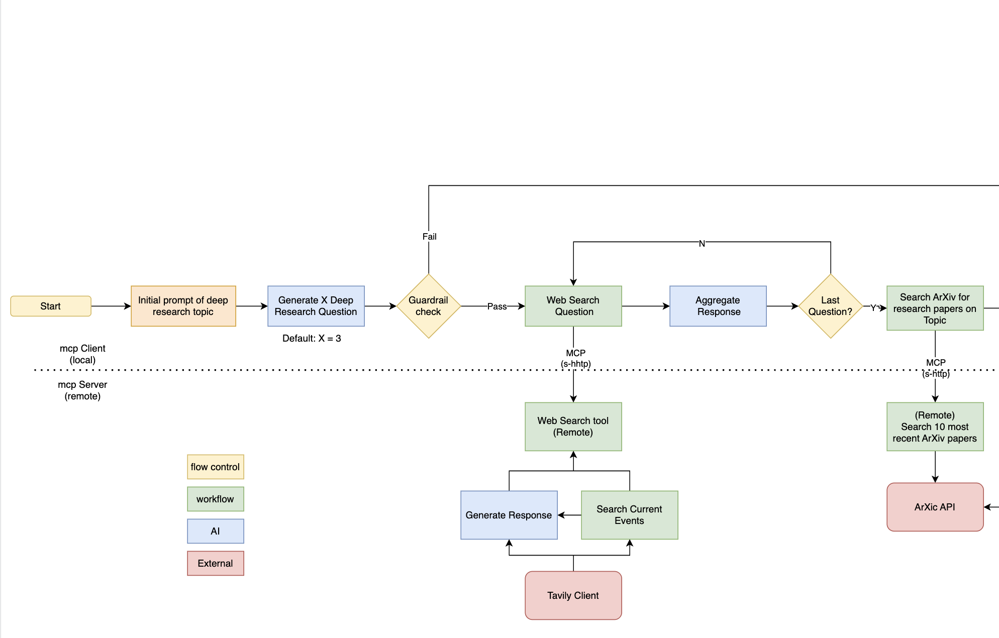

# AWS Strands Client for Deep Research Agent

## Overview
This repository provides an AWS Strands client for a Deep Research agent based on the Llama 4 model family. In this example, you can enable AWS Guardrails and AWS Knowledge bases for enhanced support.  The client supports various access methods, including:


- Native API (Llama API)
    file: llama4-DeepResearch-strands-llamaApi.py
- AWS Bedrock
- Ollama
    file: llama4-DeepResearch-strands-ollama.py


 

## Prerequisites
To use this client, you'll need the following:

1. AWS CLI
2. Boto3
3. Python 3.10 or higher
4. Pip

## Installation

1. Configure your AWS CLI:
   ```
   aws configure
   ```

2. Install the required libraries:
   ```
   pip install strands-agents
   pip install strands-agents-tools
   pip install llama-api-client
   ```

## Usage

The client provides examples for using the different access methods:

1. Native API (Llama API):
   ```python
   # Code to use the Llama API client
   # python3 llama4-DeepResearch-strands-llamaApi.py
   ```

2. AWS Bedrock:
   ```python
   # Code to use the AWS Bedrock client
   ```

3. Ollama:
   ```python
   # Code to use the Ollama client
   python3 llama4-DeepResearch-strands-ollama.py
   ```

For detailed usage examples, please refer to the individual example files in the repository.




## Contributing

If you find any issues or have suggestions for improvements, please feel free to open an issue or submit a pull request.

## License

This project is licensed under the [MIT License](LICENSE).