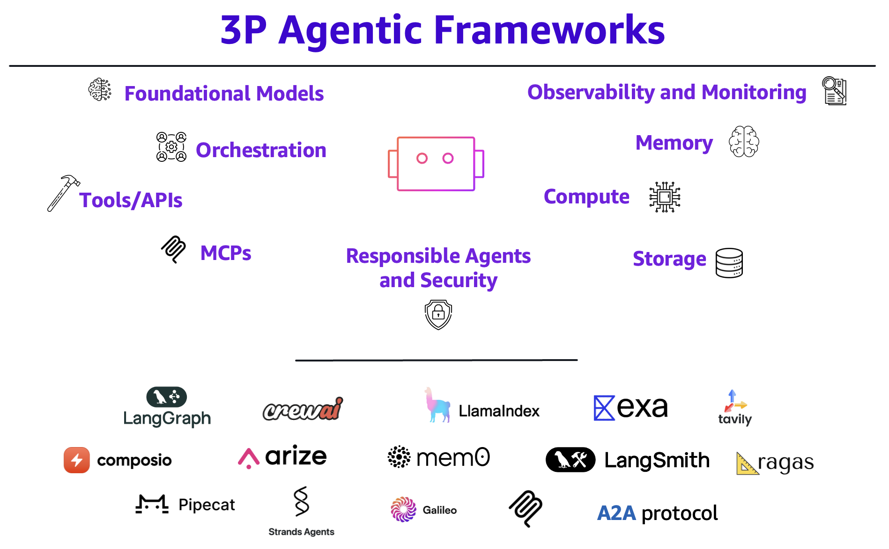

## 3P Agentic Frameworks

  

This repository provides examples and reference architectures for building autonomous agents using popular frameworks like LangGraph, CrewAI, and LlamaIndex on AWS services. These examples demonstrate how to leverage AWS services to create production-ready agent applications for various industry verticals.

## Table of Contents
- [Examples](#examples)
- [AWS Blogs](#Blogs)
- [Workshops](#Workshops)

## Examples
- [🛡️ AWS Infrastructure Security Audit And Reporting Crew](https://github.com/aws-samples/3P-Agentic-Frameworks/tree/main/crewai/aws-security-auditor-crew)
- [🤖 Automate Customer Support with Amazon Bedrock, LangGraph and Mistral models](https://github.com/aws-samples/3P-Agentic-Frameworks/blob/main/langgraph/Customer_Support_Automation_with_Bedrock_and_LangGraph.ipynb)
- [🤝 Multi-Agent Collaboration and Orchestration using LangGraph for Mistral Models](https://github.com/aws-samples/3P-Agentic-Frameworks/blob/main/langgraph/Multi_Agent_LangGraph_Mistral.ipynb)
- [🔀 Mistral-AWS ecosystem LLM router - ReAct Agent with LangChain](https://github.com/aws-samples/3P-Agentic-Frameworks/blob/main/langgraph/Mistral-AWS-ecosystem-LLM-router.ipynb)
- [👀 Vision QA Agent with Mistral and LlamaIndex](https://github.com/aws-samples/3P-Agentic-Frameworks/blob/main/llamaindex/Vision_QA_Agent_with_Mistral_and_LlamaIndex.ipynb)
- [🛠️ End-to-End Serverless Multi-Agent System: A2A Protocol Implementation on AWS](https://github.com/aws-samples/3P-Agentic-Frameworks/tree/main/a2a-protocol/a2a-advisory-trading)

## AWS Blogs 
- [🛠️ Build agentic systems with CrewAI and Amazon Bedrock](https://aws.amazon.com/blogs/machine-learning/build-agentic-systems-with-crewai-and-amazon-bedrock/)
- [🤖 Build agentic AI solutions with DeepSeek-R1, CrewAI, and Amazon SageMaker AI](https://aws.amazon.com/blogs/machine-learning/build-agentic-ai-solutions-with-deepseek-r1-crewai-and-amazon-sagemaker-ai/)
- [🔌 Extend large language models powered by Amazon SageMaker AI using Model Context Protocol](https://aws.amazon.com/blogs/machine-learning/extend-large-language-models-powered-by-amazon-sagemaker-ai-using-model-context-protocol/)
- [🧑‍🤝‍🧑 Build a Multi-Agent System with LangGraph and Mistral on AWS](https://aws.amazon.com/blogs/machine-learning/build-a-multi-agent-system-with-langgraph-and-mistral-on-aws/)
- [🤝 Build multi-agent systems with LangGraph and Amazon Bedrock](https://aws.amazon.com/blogs/machine-learning/build-multi-agent-systems-with-langgraph-and-amazon-bedrock/)
- [📜 Automating regulatory compliance: A multi-agent solution using Amazon Bedrock and CrewAI](https://aws.amazon.com/blogs/machine-learning/automating-regulatory-compliance-a-multi-agent-solution-using-amazon-bedrock-and-crewai/)

## Workshops
- [LangGraph Agents with Amazon Bedrock](https://github.com/aws-samples/langgraph-agents-with-amazon-bedrock)
- [Building Effective AI Agents on Amazon Web Services](https://catalog.workshops.aws/building-effective-ai-agents-on-aws/en-US)

## Contributing
We welcome contributions! Please read our Contributing Guidelines for details on how to submit pull requests, report issues, and contribute to the project.

## Security

See [CONTRIBUTING](CONTRIBUTING.md#security-issue-notifications) for more information.

## License

This library is licensed under the MIT-0 License. See the LICENSE file.

## Support

- Create an Issue
- Check out the Wiki
- Read our Documentation