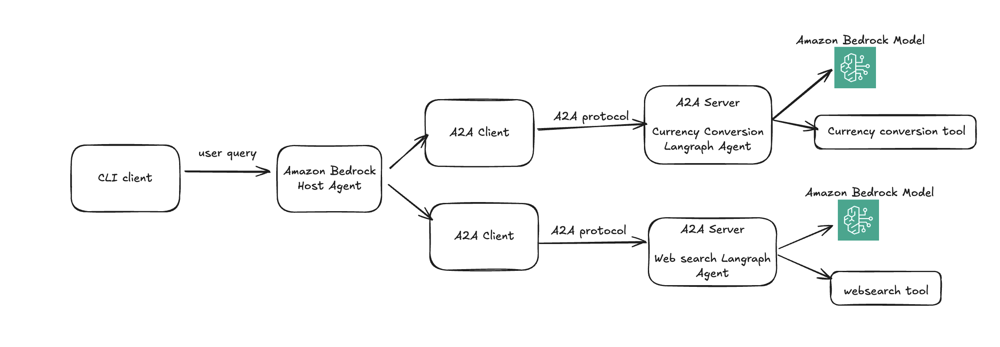

# Bedrock Agents with A2A Protocol - Internal Only, not an offical AWS code

This repository contains sample code to demonstrate how to create agents in Amazon Bedrock and enable communication between agents using the A2A (Agent-to-Agent) Protocol.

---

## Environment Setup

- Ensure you've enabled Claude models in the Bedrock Console  
- Ensure you have adequate permissions to call Bedrock from the Python SDK (Boto3)  
- Python 3.12 or higher is required  
- [UV](https://github.com/astral-sh/uv) package manager is recommended

---

## Table of Contents

- [Project Overview](#project-overview)
- [Folder Structure](#folder-structure)
- [Getting Started](#getting-started)
- [Agent Implementations](#agent-implementations)
- [Host Applications](#host-applications)
- [Contributing](#contributing)
- [License](#license)

---

## Project Overview

This project demonstrates how to build and deploy AI agents using Amazon Bedrock and the A2A (Agent-to-Agent) protocol. It includes multiple agent implementations and host applications:



### Agents
Specialized AI agents that can perform specific tasks:
- **Web Search Agent**: Searches the web and Wikipedia for information
- **Currency Converter Agent**: Converts between different currencies

### Hosts
Applications that coordinate and communicate with agents:
- **Bedrock Host**: Uses Bedrock Inline Agents to coordinate requests to other agents
- **CLI Host**: A command-line interface for interacting with agents

Each implementation showcases different approaches to building AI agents that can communicate with each other and provide helpful responses to user queries.

---

## Folder Structure

```
A2A-Protocol-Bedrock-Agents/
├── images/                # Project images and diagrams
├── samples/               # Sample implementations
│   └── python/
│       ├── agents/
│       │   ├── currencyconvertoragent/ # Currency converter agent using LangGraph
│       │   ├── websearchagent/         # Web search agent using Bedrock
│       │   └── README.md               # Agent implementation details
│       ├── common/        # Shared utilities and types
│       │   ├── client/    # A2A client implementation
│       │   ├── server/    # A2A server implementation
│       │   └── utils/     # Utility functions
│       ├── hosts/         # Host implementations for agents
│       │   ├── bedrock/   # Bedrock host agent
│       │   ├── cli/       # Command-line interface host
│       │   └── README.md  # Host implementation details
├── CODE_OF_CONDUCT.md
├── CONTRIBUTING.md
├── LICENSE
└── README.md             # This file
```

---

## Getting Started

### Clone the repository

```bash
git clone https://github.com/aws-samples/a2a-bedrock.git
cd a2a-bedrock
```

### run bedrock currency convertor agent using [readme](./samples/python/agents/currencyconvertoragent/README.md)


### run bedrock wikipedia agent using [readme](./samples/python/agents/websearchagent/README.md)


### run a host agent using [readme](./samples/python/hosts/bedrock/README.md)

### run a cli client application using [readme](./samples/python/hosts/cli/README.md)


---

## Agent Implementations

### Web Search Agent
A Bedrock-based agent that can search the web and Wikipedia for information. It uses the Tavily API for web search capabilities.

### Currency Converter Agent
A LangGraph-based agent that can convert between different currencies. It supports multi-turn conversations to gather all necessary information for currency conversion.

---

## Host Applications

### Bedrock Host
A host agent built with Bedrock Inline Agents that coordinates user requests and delegates them to other agents via the A2A Protocol.

### CLI Host
A command-line interface that demonstrates the capabilities of an `A2AClient`. It supports reading a server's `AgentCard` and text-based collaboration with remote agents.

---

## Contributing

See [CONTRIBUTING.md](CONTRIBUTING.md) for more information.

---

## Authors

- Randy DeFauw, Sr. Principal SA, AWS
- Ramprasath S, Sr Applied AI Architect, AWS

## Security

See [CONTRIBUTING.md](CONTRIBUTING.md) for security guidelines and disclosures.

---

## License

This library is licensed under the MIT-0 License. See the [LICENSE](LICENSE) file for details.