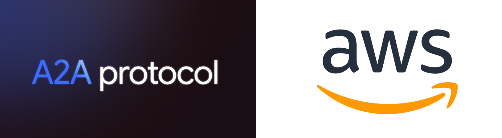

## A2A Protocol


A2A is an open protocol developed by Google that enables autonomous communication between AI agents across different organizational and technological boundaries. Its key characteristics include: [2]

- Independent Operation: Agents can accomplish tasks without sharing internal memory, thoughts, or tools
- Modality-Agnostic Design: Supports various forms of communication (text, audio/video, forms, etc.)
- Enterprise-Ready Features: Built-in support for authentication, security, privacy, tracing, and monitoring
- Asynchronous Architecture: Handles long-running tasks and human-in-the-loop scenarios
- Simplified Implementation: Built on existing standards for easier adoption

The protocol essentially acts as a standardized language that allows AI agents to communicate, collaborate, and coordinate their activities efficiently, with minimal human intervention.

## A2A Protocol Official Documentation

**Docs:** https://developers.googleblog.com/en/a2a-a-new-era-of-agent-interoperability/

**Google Developer Codelabs:** https://codelabs.developers.google.com/intro-a2a-purchasing-concierge#1

## A2A Protocol + AWS

### [A2A Advisory Trading](a2a-adivsory-trading)
This project demonstrates the implementation of Google's Agent2Agent (A2A) Protocol in a serverless AWS environment, using advisory trading as a case study. It leverages the A2A SDK, Strands Agent, and Strands SDK's MCP tools to showcase how multi-agent systems can communicate effectively over HTTP while utilizing cloud-native services.

### Importing LLMs from Amazon Bedrock

**Model IDs Supported:** https://docs.aws.amazon.com/bedrock/latest/userguide/models-supported.html

**LLM Configuration:**

```python
AWS_ACCESS_KEY_ID=<your-access-key>
AWS_SECRET_ACCESS_KEY=<your-secret-key>
AWS_DEFAULT_REGION=<your-region>

llm = LLM(
    model="bedrock/{model-id}"
)
```
