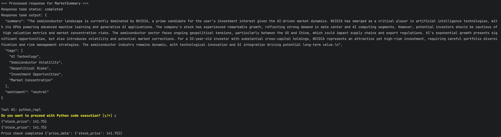
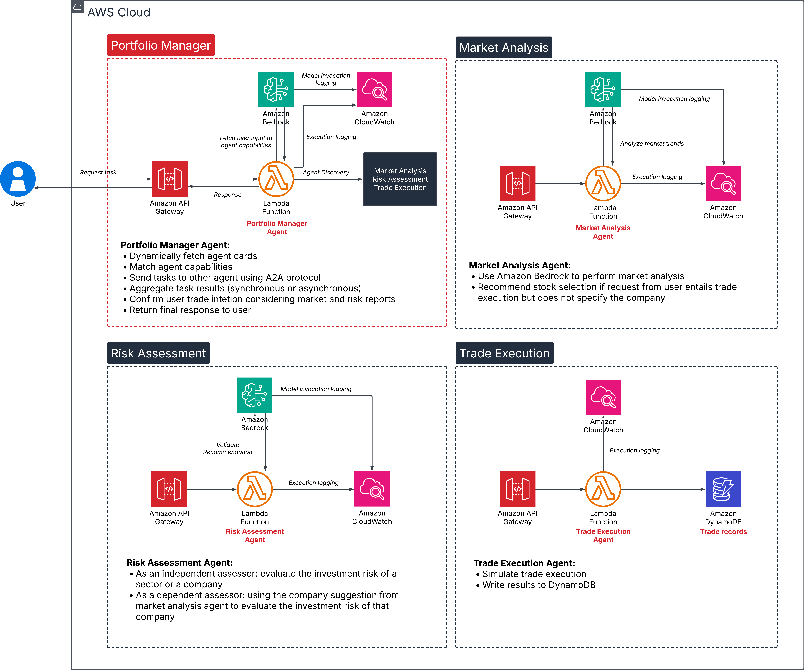

# A2A Advisory Trading

A serverless multi-agent trading advisory system built on AWS, leveraging Google's Agent2Agent Protocol using a2a SDK, Strands Agent, and built-in MCP tools from Strands SDK to deliver personalized investment analysis, risk assessment, and secure trade execution.

This project serves as a reference implementation demonstrating how to design and deploy multi-agent systems using Google's Agent2Agent Protocol on AWS through a serverless architecture, powered by Strands Agent and Amazon Bedrock. It showcases patterns for building agent networks while leveraging cloud-native services.


## Table of Content
- [Key Features](#technical-stack)
  - [Agent2Agent Protocol Implementation with a2a SDK](#agent2agent-protocol-implementation-with-a2a-sdk)
  - [Strands Agent Integration with Bedrock Model](#strands-agent-integration-with-bedrock-model)
  - [Strands Built-in MCP Integration](#strands-built-in-mcp-integration)
  - [Analysis Personalization](#analysis-personalization)
  - [Serverless Infrastructure](#serverless-infrastructure)
- [Architecture Design](#architecture-design)
- [Agents Interaction](#agent-interactions)
- [Project Structure](#project-structure)
- [AWS Solutions Deployment](docs/main/solution_deployment.md)
  - [Installation](docs/main/solution_deployment.md#installation)
  - [Deployment Prerequisites](docs/main/solution_deployment.md#deployment-pre-requisite)
  - [Deployment Steps](docs/main/solution_deployment.md#deployment-steps)
  - [Using the CLI](docs/main/solution_deployment.md#using-the-cli)
  - [Testing Agents Logic](docs/main/solution_deployment.md#testing-agents-logic)
  - [Service Quota for API Gateway Integration](docs/main/solution_deployment.md#service-quota-for-api-gateway-integration)
- [Developer Guide](docs/main/development_guide.md)
  - [Development Prerequisites](docs/main/development_guide.md#installation)
  - [Local Environment Setup](docs/main/development_guide.md#local-setup-pre-requisite)
  - [Understand Local Servers Configuration](docs/main/development_guide.md#understand-local-servers-configuration)
    - [Path Configuration](docs/main/development_guide.md#path-configuration)
    - [Local Agent Discovery](docs/main/development_guide.md#local-agent-discovery)
  - [Running Agents Locally](docs/main/development_guide.md#running-the-servers)
  - [Agent Development and Testing](docs/main/development_guide.md#testing-agents)
  - [Using MCP Tools](docs/main/development_guide.md#using-mcp-tools)
- [Demo](#demo)
  - [Demo Flow](docs/main/demo_flow.md)
- [Common Pattern Across Industries](#common-patterns-across-industries)

## Key Features

#### Agent2Agent Protocol Implementation with a2a SDK
The platform leverages Google's Agent2Agent Protocol by using `a2a-sdk` to enable:
- Structured agent-to-agent communication
- Standardized agent discovery in a network of agents
- Coordinated decision-making processes

`a2a-sdk` is the official open-source Python SDK for compliance with A2A Protocol. 

Refer to [Python SDK Reference](https://google-a2a.github.io/A2A/sdk/python/) for class definitions and detail documentation. 

#### Strands Agent Integration with Bedrock Model:
The platform leverages Amazon's Strands Agent to enable:
- Foundation model integration through Amazon Bedrock with configurable model selection
- Asynchronous task processing with state management and error handling
- Structured agent responses with consistent JSON formatting and logging

#### Strands Built-in MCP Integration
The platform leverages Strands' built-in MCP tools to enable:
- Built-in Python REPL tool for code execution and data processing
- Built-in http request to make API calls, fetch web data, and call local HTTP servers
- Note: The current solution only supports Python REPL and http request tool in local environment



#### Analysis Personalization
- Market Analysis and Risk Assessment take into consideration of user financial profile when generating insights

#### Serverless Infrastructure
- **Compute Layer**: AWS Lambda for scalable, event-driven processing and hosting of agents
- **Data Layer**: Amazon DynamoDB for low-latency write execution
- **API Layer**: Amazon API Gateway for REST endpoints, serving agent cards and agent's task fulfillment
- **AI/ML Layer**: Amazon Bedrock for foundation model integration
  - Support for specialized tasks
  - Reasoning for task analysis and agent selection
- **Observability**: Amazon CloudWatch monitors and logs activities of all agents

## Architecture Design



The A2A Advisory Trading platform represents the approach to automated trading advisory through a distributed agent-based architecture. At its core, the system orchestrates multiple specialized AI agents that work in concert to analyze market conditions, assess risk on an investment decision, and execute trade.

### Agents Specialization

The Portfolio Manager Agent serves as the central orchestrator of the system, responsible for discovering user intent from their inputs, identifying relevant agents based on their stated capabilities in agent cards, and delegating tasks accordingly. It also plays a crucial role in presenting analysis findings to users and confirming their trading decisions based on reports from other agents. 

The Market Analysis Agent provides insights about market conditions, trends, and potential opportunities. It incorporates user provided financial context or investment profile to give insights of how the current sector or industry situation affects the investor in context.

The Risk Assessment Agent provides risk score assessment on the sector as a whole, or on an investing company. It incorporates user provided financial context or investment profile to determine the risk of investment for a trade decision. 

The Trade Execution then handles the final phase, managing the actual implementation of trading decisions. In this phase, user will confirm their options in executing a trade. 

This agent ecosystem ensures a structured workflow where the Portfolio Manager coordinates all interactions between users and specialized agents, maintaining a clear chain of responsibility from initial user intent to final trade execution.

### A2A Protocol

The implementation of Google's Agent2Agent Protocol as our communication framework ensures standardized and reliable interaction between agents. The protocol's structured communication patterns help maintain system integrity and ensure that all agents operate with consistent information and clear objectives.

#### Agent Discovery using Registry 
Agent discovery in our project is dynamic and environment-aware. When agents are hosted in the same AWS account, we use naming conventions and AWS APIs to automatically discover each agent’s API Gateway ID and construct their endpoints. 
This lets the Portfolio Manager query each agent’s `/.well-known/agent.json` to get capabilities and metadata at runtime. 
The discovery logic is implemented in `a2a_core/agent_registry.py`.

For cross-account, cross-org, or cross-team deployments where automatic API ID discovery is not possible, our code can fall back to a static agent registry—a list or dictionary of known agent endpoints, which can be loaded from a config file, S3 bucket, or environment variable. 
The registry logic in `agent_registry.py` checks the environment, and if dynamic discovery is not available or fails, it loads and uses the static registry instead as seen for local environment.
This design allows seamless agent discovery in both single-account (fully automated) and multi-account (manual/static) scenarios.

#### Task Delegation and Lifecycle 
When a user submits a request (via cli.py), the Portfolio Manager creates a new Task object, decomposes it into subtasks (Market Analysis, Risk Assessment, Trade Execution), and delegates each to the correct agent using HTTP requests. Task states progress from submitted → in-progress → completed or failed. The PM waits for sub-agent responses, handles missing information or errors, and, for trades, prompts the user for confirmation before final execution. All interactions, results, and status changes are tracked and auditable.

### Lightweight Serverless Architecture

Our implementation of an Agent2Agent (A2A) network using AWS serverless infrastructure, specifically Lambda and DynamoDB, serves as a streamlined demonstration of agent-based architectures in practice. While we've built our implementation on AWS, it's crucial to understand that the A2A protocol itself is platform-agnostic - agents can be hosted on any compute platform, from EC2 instances to containers or even on-premises infrastructure. We chose Lambda functions to provide a clear, simplified example of how specialized agents can communicate through HTTP endpoints via API Gateway. As organizations accelerate their adoption of agent-based systems, their internal networks may grow to encompass hundreds or thousands of agents. In this context, efficient agent discoverability and lightweight hosting infrastructure become essential for rapid deployment and scaling.

This architecture demonstrates the core principles of A2A communication while maintaining minimal infrastructure overhead and high reproducibility. Each Lambda function encapsulates a specialized agent with distinct capabilities, illustrating how agents can discover, interact, and collaborate across different hosting environments. DynamoDB complements this serverless architecture by providing consistent, millisecond-level response times and automatic scaling - capabilities crucial for high-performance agent operations. Together, this implementation serves as a practical reference model for organizations looking to build and scale agent networks while leveraging the simplicity and efficiency of serverless computing.

## Agent Interactions


The Portfolio Manager (PM) serves as the primary interface, intelligently routing user queries to specialized agents based on the nature of the request. Each agent is designed with specific capabilities: Market Analysis for industry and economic insights, Risk Assessment for evaluating investment risks, and Trade Execution for processing trading orders. When interacting with the system, the clarity and specificity of your queries directly influence the PM's ability to delegate tasks effectively. For market analysis, queries about industry trends, economic conditions, or sector performance will trigger the Market Analysis agent. Risk-related questions or concerns about investment safety will be directed to the Risk Assessment agent. To engage the Trade Execution agent, requests must include specific trading actions (buy/sell), quantities, and company symbols (e.g., "Buy 100 shares of XYZ"). Currently, the system processes one company or industry per request, ensuring focused and accurate responses. For complex queries that require multiple steps (such as "Find the best performing oil company to invest in"), the PM will automatically decompose the request into sequential tasks, engaging relevant agents in order - from market analysis to risk assessment, and finally to trade execution when appropriate. The effectiveness of this task delegation relies on the AI model's ability to understand and break down user requests, making clear and specific queries particularly important for optimal results.


> **Disclaimer:**
> This tool is developed primarily to demonstrate the implementation of specialized AI agents communicating via the Agent2Agent (A2A) protocol in a serverless architecture. The trading scenarios and agent interactions are designed to showcase the capabilities of A2A protocol in a practical context, not to provide actual investment guidance.

## Project Structure

```
a2a-advisory-trading/
├── dev/
│ ├── local_servers/                      # Run local servers
│ │ ├── init_dynamodb.py                  # Deploy DynamoDB table for local development 
│ │ ├── local_server_ma.py                
│ │ ├── local_server_ra.py
│ │ ├── local_server_pm.py
│ │ ├── local_server_te.py
│ │ └── servers.py                        # Function to run all servers 
│ └── local.bash                          # Bash commands for starting individual servers
├── docs/
│ ├── demo/                               # Demo video
│ ├── images/                             # Images for documentation
│ └── main/
│ ├── solution_deployment.md
│ └── development_guide.md
├── iac/
│ ├── a2a_core/                           # Core A2A and requirements for lambda layer
│ ├── agents/
│ │ ├── layers/
│ │ │ ├── layer.tf                        # Lambda layer for dependencies in deployed environment
│ │ │ ├── outputs.tf                        
│ │ │ ├── variables.tf                                
│ │ ├── market_analysis/
│ │ │ ├── main/                           # Market Analysis agent core logic
│ │ │ │ ├── handler.py
│ │ │ │ └── main.py
│ │ │ ├── agent_card.py
│ │ │ ├── main.tf                         # Terraform parameters for infra deployment
│ │ │ └── variables.tf                    # Variables used in the agent module
│ │ ├── portfolio_manager/
│ │ │ ├── main/                           # Portfolio Manager agent core logic
│ │ │ │ ├── handler.py
│ │ │ │ └── main.py
│ │ │ ├── agent_card.py
│ │ │ ├── main.tf                         # Terraform parameters for infra deployment
│ │ │ └── variables.tf                    # Variables used in the agent module
│ │ ├── risk_assessment/
│ │ │ ├── main/                           # Risk Assessment agent core logic
│ │ │ │ ├── handler.py
│ │ │ │ └── main.py
│ │ │ ├── agent_card.py
│ │ │ ├── main.tf                         # Terraform parameters for infra deployment
│ │ │ └── variables.tf                    # Variables used in the agent module
│ │ └── trade_execution/
│ │ │ ├── main/                           # Trade Execution agent core logic
│ │ │ │ ├── handler.py
│ │ │ │ └── main.py
│ │ │ ├── agent_card.py
│ │ │ ├── main.tf                         # Terraform parameters for infra deployment
│ │ │ ├── dynamodb.tf                     # Terraform resources defined to deploy DynamoDB table 
│ │ │ └── variables.tf                    # Variables used in the agent module
│ ├── roots/                              # Shared terraform resource to deploy all agents infrastructure
│ │ ├── api_gateway.tf
│ │ ├── iam.tf
│ │ ├── lambda.tf
│ │ ├── outputs.tf
│ │ └── variables.tf
├── cli.py                                # CLI interface for the project
├── Makefile                              # Make commands and global variables for deployment
└── README.md
```

## Demo

Refer to the full [Demo Walkthrough](docs/main/demo_flow.md)

## Common Patterns Across Industries

This architecture pattern is particularly valuable for scenarios requiring:
- Complex decision-making processes
- Multiple specialized knowledge domains
- Asynchronous workflows
- Scalable computing needs

## Next Steps 
- [Demo Walkthrough](docs/main/demo_flow.md)
- [AWS Solution Deployment](docs/main/solution_deployment.md)
- [Development Guide](docs/main/development_guide.md)
