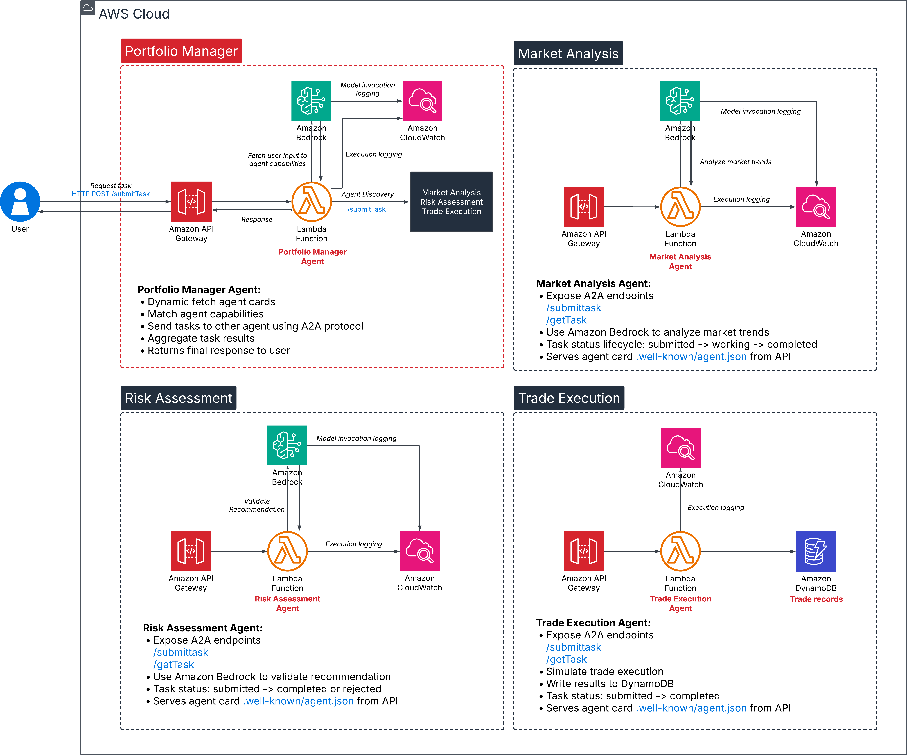
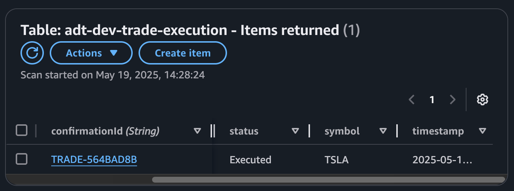

# A2A Advisory Trading

A stateful multi-agent serverless application built on Google's Agent2Agent Protocol for intelligent trading advisory services, powered by Amazon Bedrock, LangChain, and LangGraph.

This project serves as a reference implementation demonstrating how to design and deploy multi-agent systems using Google's Agent2Agent Protocol on AWS through a serverless architecture, powered by Amazon Bedrock. It showcases practical patterns for building production-ready, stateful agent networks while leveraging cloud-native services.

### Table of Content 
- [Architecture Design](#architecture-design)
- [Technical Stack](#technical-stack)
  - [Agent2Agent Protocol Implementation](#agent2agent-protocol-implementation)
  - [Serverless Infrastructure](#serverless-infrastructure)
  - [Langraph Integration](#langgraph-integration)
- [Solution Deployment](#solutions-deployment)
  - [Deployment Pre-requisite](#deployment-pre-requisite)
  - [Deployment Steps](#deployment-steps)
  - [Demo](#demo)
  - [Test Individual Sub-Agents](#test-individual-sub-agents)
- [Use Cases](#use-cases)
- [Common Pattern Across Industries](#common-patterns-across-industries)


### Architecture Design



### Technical Stack

#### Agent2Agent Protocol Implementation
The platform leverages Google's Agent2Agent Protocol to enable:
- Structured agent-to-agent communication
- Standardized agent discovery 
- Coordinated decision-making processes

#### Serverless Infrastructure
- **Compute Layer**: AWS Lambda for scalable, event-driven processing and hosting of agents
- **Data Layer**: Amazon DynamoDB for low-latency write execution
- **API Layer**: Amazon API Gateway for RESTful endpoints
- **AI/ML Layer**: Amazon Bedrock for foundation model integration
  - Support for specialized tasks
  - Reasoning for task analysis and agent selection 

#### LangGraph Integration
The platform leverages LangGraph's capabilities for:
- Agent Orchestration
- State Management
- Reasoning Engine
- Data Processing


### Solutions Deployment

The application follows a serverless-first architecture deployed on AWS:

1. Infrastructure-as-Code using Terraform
2. Monitoring and observability with CloudWatch

#### Deployment Pre-requisite

* [AWS CLI v2](https://docs.aws.amazon.com/cli/latest/userguide/getting-started-install.html)
* [Terraform >= 1.8.0](https://developer.hashicorp.com/terraform/tutorials/aws-get-started/install-cli)
* [Git CLI](https://git-scm.com/downloads)
* [Python >= 3.10](https://www.python.org/downloads/)
* [PIP >= 25.0.1](https://pypi.org/project/pip/)
* [make](https://www.gnu.org/software/make/)

On the Console, make sure Amazon BedRock has enabled access to `Claude 3 Sonnet`


#### Deployment Steps

To deploy the solutions, run the following in order: 

| Order | Command                         | Purpose                                                 | Dependency                                                         |
|-------|---------------------------------|---------------------------------------------------------|--------------------------------------------------------------------|
| 1     | `make deploy-core`              | Zip, add dependencies, and prepare a2a package in local | Pre-requisite                                                      |
| 2     | `make deploy-shared`            | Deploy the core a2a package from local as lambda layer  | Wait for layers/a2a_core.zip to be created in local before proceed |
| 3     | `make deploy-market-analysis`   | Deploy market analysis agent                            | a2a_core must be deployed as layer before proceed                  |
| 4     | `make deploy-risk-assessment`   | Deploy risk assessment agent                            | a2a_core must be deployed as layer before proceed                  |
| 5     | `make deploy-trade-execution`   | Deploy trade execution agent                            | a2a_core must be deployed as layer before proceed                  |
| 6     | `make deploy-portfolio-manager` | Deploy portfolio manager agent                          | All sub-agents must be successfully deployed before proceed        |
---

To destroy any module, run the following command: 

| Order | Command                           | Purpose                              |
|-------|-----------------------------------|--------------------------------------|
| 1     | `make destroy-core`               | Destroy bucket deployed for a2a core |
| 2     | `make destroy-shared`             | Destroy the a2a core layer           |
| 3     | `make destroy-market-analysis`    | Destroy market analysis agent        |
| 4     | `make destroy-risk-assessment`    | Destroy risk assessment agent        |
| 5     | `make destroy-trade-execution`    | Destroy trade execution agent        |
| 6     | `make destroy-portfolio-manager`  | Destroy portfolio manager agent      |
---

#### Demo

You can test your agent network end-to-end by making the query to your Portfolio Manager API Endpoint. Example: 

```bash
curl -X POST https://[Your-portfolio-manager-gateway-id].execute-api.us-east-1.amazonaws.com/dev/tasks/send \
-H "Content-Type: application/json" \
-d '{
  "task": {
    "id": "portfolio-001",
    "input": {
      "user_input": "Should I buy 25 shares of TSLA given current EV market and short-term outlook?"
    }
  }
}'
```

In the example prompt above, the agents return the following results: 

From Market Analysis Agent: 
```
'summaryLength': 899, 'tags': ['growth', 'competition', 'supply chain disruptions', 'regulatory changes', 'infrastructure'], 'sentiment': 'neutral'}
```

From Risk Assessment Agent:
```
"score": 70, "rating": "Moderate", "factors": ["competition", "supply chain disruptions", "regulatory risks", "valuation concerns"], "explanation": "While Tesla dominates the electric vehicle market, increasing competition from traditional automakers and new entrants poses a risk. Supply chain disruptions and rising material costs could impact profitability. Regulatory changes related to emissions and incentives could affect demand. Tesla's valuation remains high compared to peers, raising concerns about potential overvaluation. However, strong brand recognition, technological leadership, and growth prospects in the EV sector provide upside potential."
```

From Trade Execution Agent:
```
'confirmationId': 'TRADE-564BAD8B', 'symbol': 'TSLA', 'quantity': 25, 'action': 'Buy'
```

Trade logged to DynamoDB: 



#### Test Individual Sub-agents

You can test your agent individually 

1. **Market Analysis**

To test agent lambda event: 
```
{
  "body": "{ \"task\": { \"id\": \"market-debug-001\", \"input\": { \"sector\": \"clean energy\", \"focus\": \"investment outlook\", \"riskFactors\": [\"regulation\", \"supply chain\"], \"summaryLength\": 50 } } }"
}
```
To test agent API Gateway endpoint: 

```bash
curl -X POST "https://[Your-market-analysis-gateway-id].execute-api.us-east-1.amazonaws.com/dev/tasks/send" \
  -H "Content-Type: application/json" \
  -d '{
        "task": {
          "id": "market-test-001",
          "input": {
            "sector": "clean energy",
            "focus": "investment risks",
            "riskFactors": ["regulation", "supply chain disruption"],
            "summaryLength": 100
          }
        }
      }'
```

2. **Risk Assessment**

To test agent lambda event:
```
{
  "body": "{\"task\": {\"id\": \"risk-task-001\", \"input\": {\"action\": \"Buy\", \"symbol\": \"TSLA\", \"quantity\": 25, \"sector\": \"electric vehicles\", \"priceVolatility\": \"high\", \"timeHorizon\": \"short-term\", \"marketConditions\": \"uncertain\", \"capitalExposure\": \"moderate\"}}}"
}
```
To test agent API Gateway endpoint:

```bash
curl -X POST "https://[Your-risk-assessment-gateway-id].execute-api.us-east-1.amazonaws.com/dev/tasks/send" \
  -H "Content-Type: application/json" \
  -d '{
        "task": {
          "id": "risk-task-001",
          "input": {
            "action": "Buy",
            "symbol": "TSLA",
            "quantity": 25,
            "sector": "electric vehicles",
            "priceVolatility": "high",
            "timeHorizon": "short-term",
            "marketConditions": "uncertain",
            "capitalExposure": "moderate"
          }
        }
      }'
```

2. **Trade Execution**

To test agent lambda event:
```
{
  "body": "{\"task\": {\"id\": \"trade-debug-001\", \"input\": {\"action\": \"Buy\", \"symbol\": \"AMZN\", \"quantity\": 10}}}"
}
```
To test agent API Gateway endpoint:

```bash
curl -X POST "https://[Your-trade-execution-gateway-id].execute-api.us-east-1.amazonaws.com/dev/tasks/send" \
  -H "Content-Type: application/json" \
  -d '{
        "task": {
          "id": "trade-debug-001",
          "input": {
            "action": "Buy",
            "symbol": "AMZN",
            "quantity": 10
          }
        }
      }'
```

### Use Cases

While this project demonstrates implementation through a financial services example, the pattern of deploying multi-agent systems using Agent2Agent Protocol on serverless architecture can be applied across various industries:

#### Enterprise Applications
- **Supply Chain Management**
  - Inventory optimization agents
  - Logistics coordination agents
  - Supplier relationship agents
  - Demand forecasting agents

- **Customer Service**
  - Query routing agents
  - Knowledge base agents
  - Sentiment analysis agents
  - Resolution recommendation agents

#### Healthcare
- **Patient Care Coordination**
  - Diagnosis assistance agents
  - Treatment planning agents
  - Medical record analysis agents
  - Drug interaction checking agents

#### Manufacturing
- **Smart Factory Operations**
  - Production scheduling agents
  - Quality control agents
  - Maintenance prediction agents
  - Resource optimization agents

#### Retail
- **Personalized Shopping Experience**
  - Product recommendation agents
  - Inventory management agents
  - Price optimization agents
  - Customer behavior analysis agents

#### Energy Sector
- **Grid Management**
  - Load balancing agents
  - Energy trading agents
  - Consumption prediction agents
  - Maintenance scheduling agents

#### Research & Development
- **Scientific Research**
  - Data analysis agents
  - Literature review agents
  - Experiment design agents
  - Hypothesis generation agents

#### Common Patterns Across Industries
1. **Agent Specialization**
  - Domain-specific knowledge agents
  - Data processing agents
  - Decision-making agents
  - Coordination agents

2. **State Management**
  - Context preservation
  - Historical data tracking
  - Progress monitoring
  - Transaction management

3. **Integration Capabilities**
  - External API connectivity
  - Data source integration
  - Third-party service coordination
  - Legacy system interaction

4. **Scalability Considerations**
  - Load-based scaling
  - Geographic distribution
  - Resource optimization
  - Cost management

This architecture pattern is particularly valuable for scenarios requiring:
- Complex decision-making processes
- Multiple specialized knowledge domains
- Stateful operations
- Asynchronous workflows
- Scalable computing needs