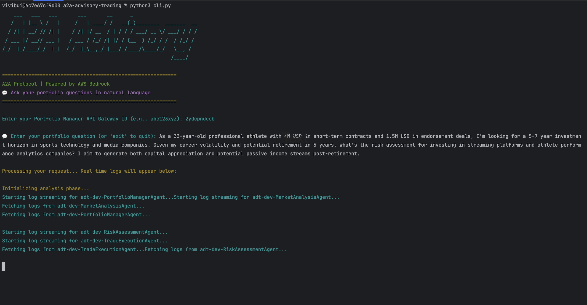
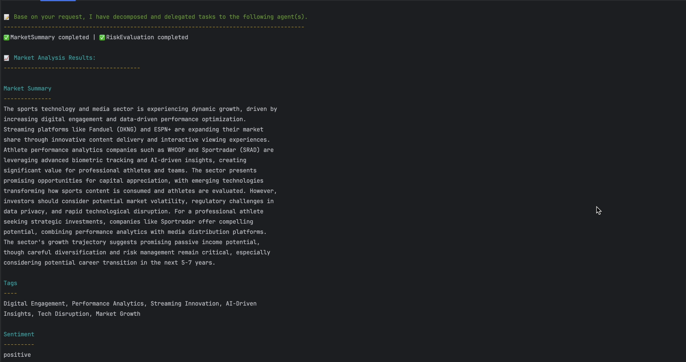
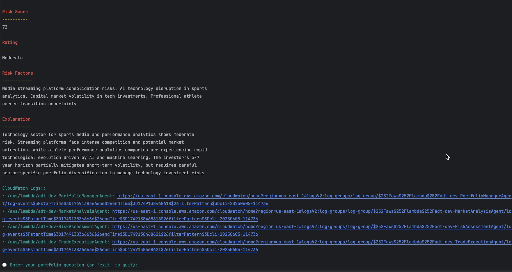
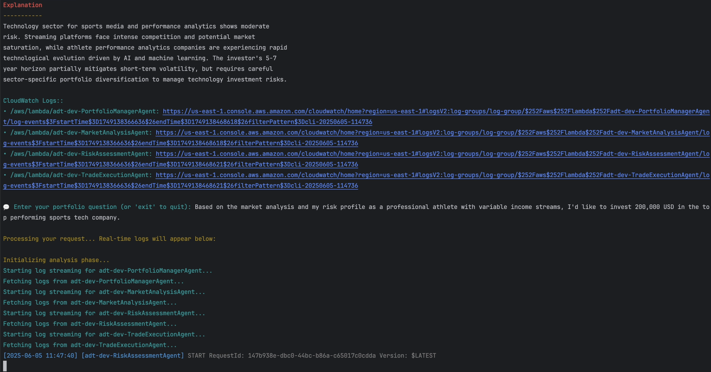
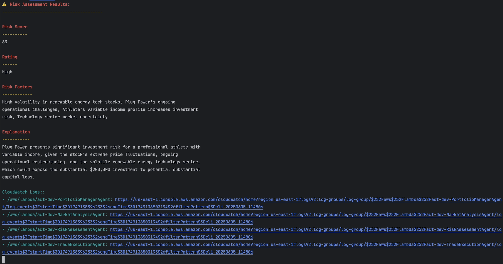
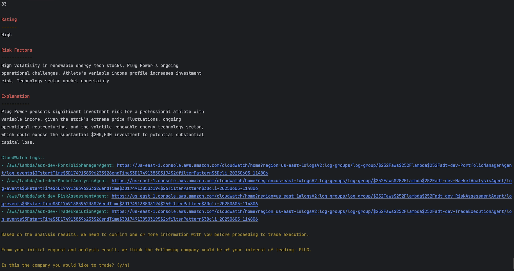
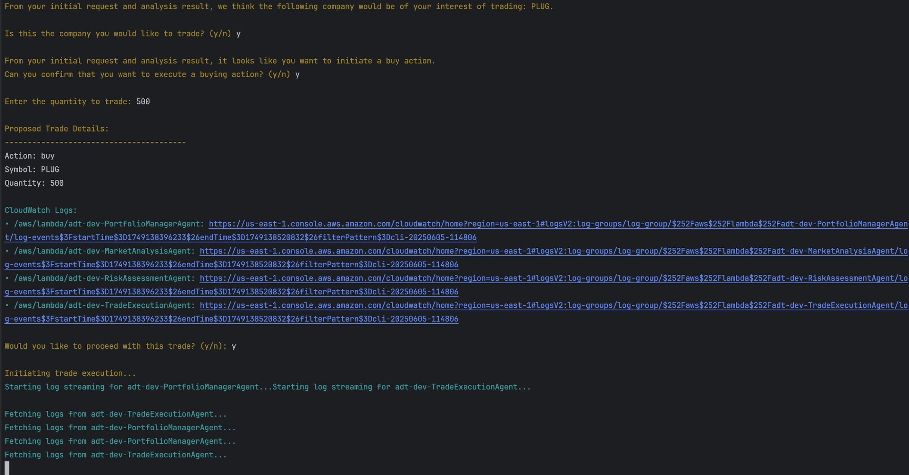
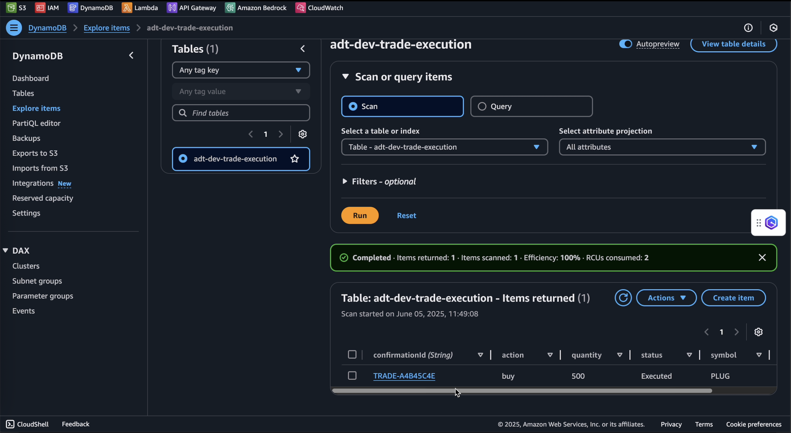
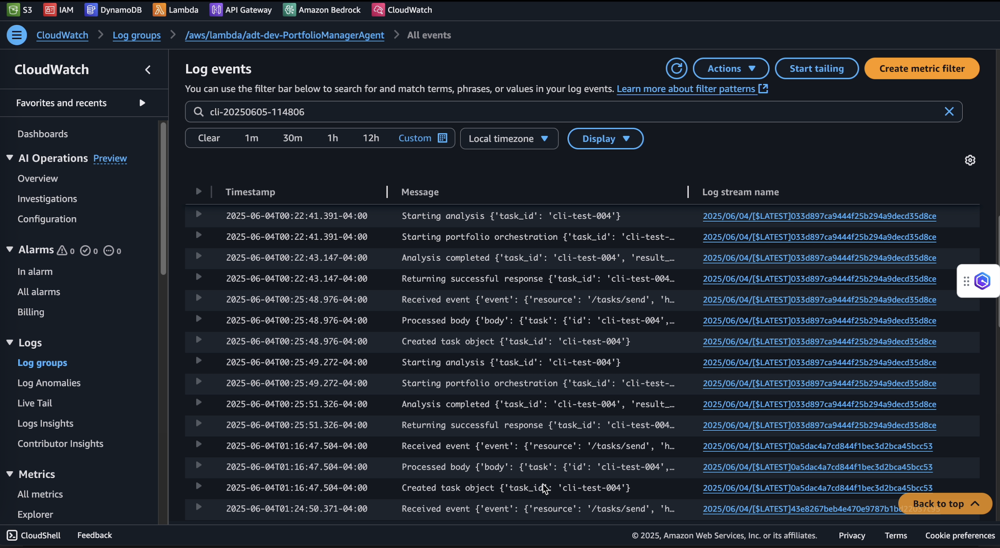

# Demo Flow

User input their financial profile and requests. 

The Portfolio Manager orchestrates and delegates tasks to the specialized agents.
Agents response after completing their tasks.

In this scenario, the tasks were delegated to Market Analysis and Risk Assessment agents. 

Response from Market Analysis agent: 

Response from Risk Assessment agent:

User can continue to follow-up with more questions during the conversation.
User expresses their interest to make a trade with the Portfolio Manager.

In this scenario, the user clearly states the amount of investment they want to put in.

Portfolio Manager delegates task to Risk Assessment to analyze the investment risk in the context of expecting investment amount, term, and user profile.

Knowing the analysis result, user should confirm their stock selection, quantity, and intention of buying or selling.

Portfolio Manager then delegates task to Trade Execution.

Once a trade is confirmed, user can see its execution history written to the DynamoDB.

User can review all agents activities and input history by clicking on CloudWatch log groups.

