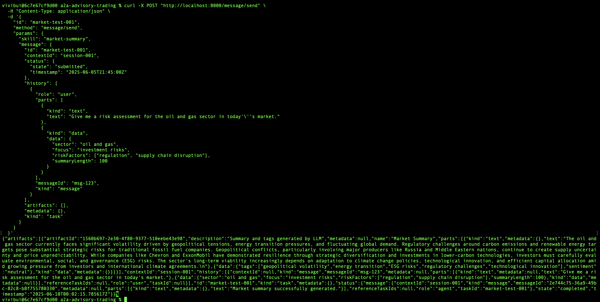
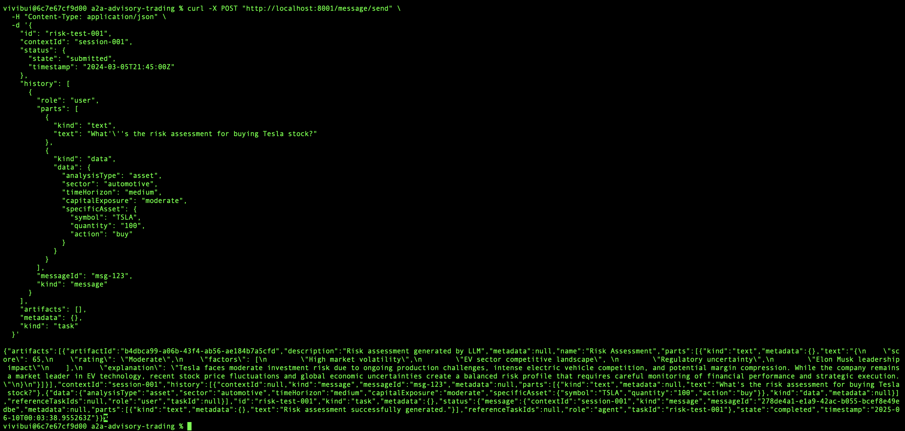
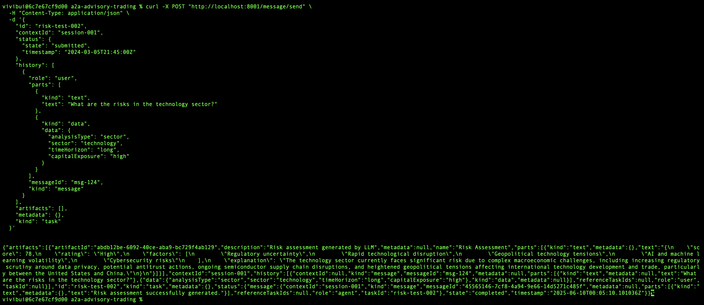
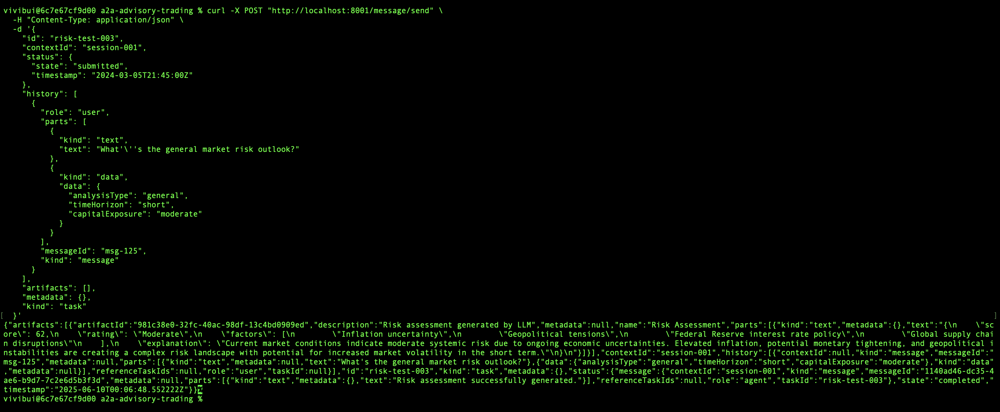
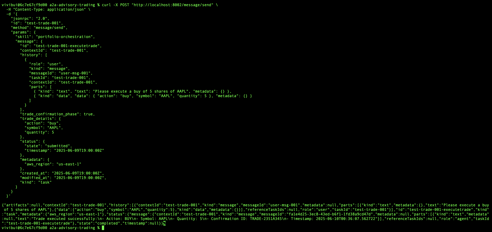
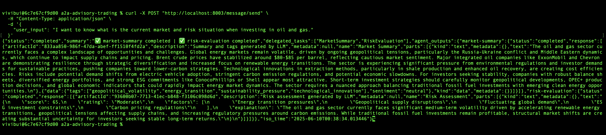

# Development Guide

## Introduction

This guide provides comprehensive setup instructions for developers who want to leverage and extend this asset for their own use cases. The project follows a modular architecture that separates agent logic from infrastructure concerns, allowing for flexible development and deployment.

This guidance would address: 
- **Loosely Coupled Architecture**: Clear separation between agent business logic and infrastructure hosting
- **Modular Design**: Each agent operates as an independent service with well-defined interfaces
- **Local Development Support**: Full development environment that mirrors production setup
- Modify agent behavior without touching infrastructure code
- Test changes locally before deployment
- Add new agents without restructuring the existing system
- Deploy to different environments with minimal configuration changes

## Table of Content
- [Installation](#installation)
- [Local Setup Pre-requisite](#local-setup-pre-requisite)
- [Understand Local Servers Configuration](#understand-local-servers-configuration)
  - [Path Configuration](#path-configuration) 
  - [Local Agent Discovery](#local-agent-discovery)
- [Running the Servers](#running-the-servers)
- [Testing Agents](#testing-agents)
- [Using MCP Tools](#using-mcp-tools)

## Installation

- Clone the repository: 
```bash
git clone https://github.com/aws-samples/3P-Agentic-Frameworks.git
```

- Navigate to the project root directory (`a2a-advisory-trading/`): 
```
cd a2a-protocols/a2a-advisory-trading
```

## Local Setup Pre-requisite

* [Python >= 3.12](https://www.python.org/downloads/)
* [PIP >= 25.0.1](https://pypi.org/project/pip/)
* On the Console, make sure Amazon BedRock has enabled access to your model of choice
* Install uvicorn
```python
pip install uvicorn
```
* Install the requirements.txt for agents' dependencies:
```python
pip install -r iac/a2a_core/requirements.txt
```
* Install the following libraries for the CLI start:
```python
pip install pyfiglet colorama halo aiohttp boto3
```
* (Optional) Create and activate a virtual environment:
```
# For macOS/Linux
python -m venv venv
source venv/bin/activate

# For Windows
python -m venv venv
.\venv\Scripts\activate
```

* Create the `.env` in the project root directory (`a2a-advisory-trading/`) file with the following information:
```
  APP_NAME=adt
  ENV_NAME=local
  AWS_REGION=us-east-1
  BEDROCK_MODEL_ID=your-bedrock-model-id
  AWS_ACCESS_KEY_ID=your-access-key-id
  AWS_SECRET_ACCESS_KEY=your-secret-access-key
  TRADE_LOG_TABLE=your-dynamodb-table-for-trade-logging (optional)
```

* Note: `TRADE_LOG_TABLE` is optional. You only need to deploy a DynamoDB and specify this value if you want to develop and test the logic of trade execution.

#### Environment Variables Explanation

| Variable                   | Description                           | Example                      |
|----------------------------|---------------------------------------|------------------------------| 
| APP_NAME                   | Application identifier                | `adt`                        |
| ENV_NAME                   | Environment name                      | `dev`, `staging`, `prod`     |
| AWS_REGION                 | AWS region for services               | `us-east-1`                  |
| BEDROCK_MODEL_ID           | Your Amazon Bedrock model ID	         | `anthropic.claude-v2`        |
| AWS_ACCESS_KEY_ID          | AWS access key                        | From AWS IAM                 |
| AWS_SECRET_ACCESS_KEY      | AWS secret key                        | From AWS IAM                 |
| TRADE_LOG_TABLE (optional) | DynamoDB table name for trade logging | `adt-local-trade-execution`    |

#### DynamoDB Table Configuration for Trade Execution

**Note**: The `TRADE_LOG_TABLE` setting requires special attention:

- If you've deployed using Terraform, use the auto-generated table name
- Default format: {app_name}-{env_name}-trade-execution
- Example: adt-dev-trade-execution

If you have not deployed the solution end-to-end using Terraform module, you have 2 options:
- Create a table manually through AWS Console
- Use our provided Python script to create the table automatically

To use our Python script to create the DynamoDB table: 

```
cd local_servers
python init_dynamodb.py
```

Important Notes: 
- Ensure your DynamoDB table is in the same region as other AWS services
- Verify your AWS credentials have appropriate permissions for DynamoDB operations

## Understand Local Servers Configuration

#### Path Configuration

- The project uses path configuration to help local servers find and run the main code located in the /agents directory
- You can find these path configurations in two places:
  - `local_servers/config.py`
  - All server files named `local_server_{agent}.py`
- Each server file contains this important path setup code:
```python
current_dir = Path(__file__).parent    # Gets the current file's directory
root_dir = current_dir.parent          # Gets the project's root directory
sys.path.insert(0, str(root_dir))      # Adds project root to Python's path
```
- You can customize these path settings to match your project's folder structure. For example:
  - Change the number of `.parent` calls if your folders are organized differently
  - Add more paths to `sys.path` if needed 
  - Modify the root directory location to match your setup

#### Local Agent Discovery
- Local agents are discovered through agent card URLs listed in `a2a_core/agent_registry.py`:
```python
LOCAL_AGENT_CARD_URLS = [
    "http://localhost:8000/.well-known/agent.json", # market analysis 
    "http://localhost:8001/.well-known/agent.json", # risk assessment
    "http://localhost:8002/.well-known/agent.json", # trade execution 
    "http://localhost:8003/.well-known/agent.json"  # portfolio manager  
]
```
- To manage agents: Simply add or remove URLs from this list, ensuring each agent has a unique port number

## Running the Servers

#### Option 1: Run all agents servers 

From the project root directory:

```python
python dev/local_servers/servers.py
```

This will start all services on their respective ports in the same terminal:

- Market Analysis: http://localhost:8000
- Risk Assessment: http://localhost:8001
- Trade Execution: http://localhost:8002
- Portfolio Manger: http://localhost:8003

#### Option 2: Run individual server (recommended)

This option is recommended for development since developers can trace each agent operations easier with separated terminal per agent.

From the project root directory, navigate to `local_servers/`
```
cd dev/local_servers
```

Run the following commands respectively to start your agent servers:
```python
# Market Analysis Agent
uvicorn local_server_ma:app --reload --port 8000

# Risk Assessment Agent
uvicorn local_server_ra:app --reload --port 8001

# Trade Execution Agent
uvicorn local_server_te:app --reload --port 8002

# Portfolio Manager Agent
uvicorn local_server_pm:app --reload --port 8003
```

## Testing agents

Once the servers are up and running, we can test each individual agent server either using the interactive custom cli or curl command.

#### Testing with curl commands 

During agent development, using CURL commands provides a direct and efficient way to test individual agent endpoints without relying on the Portfolio Manager's routing logic. This approach is particularly useful when:

- Developing new agent functionality
- Testing agent endpoints in isolation
- Debugging specific agent responses
- Validating API endpoints before integration
- Working on agents that aren't yet connected to the Portfolio Manager

Below are the examples of the attributes we need to make the request to the server.

- For market analysis agent: 

```
curl -X POST "http://localhost:8000/message/send" \
  -H "Content-Type: application/json" \
  -d '{
    "id": "market-test-001",
    "method": "message/send",
    "params": {
      "skill": "market-summary",
      "message": {
        "id": "market-test-001",
        "contextId": "session-001",
        "status": {
          "state": "submitted",
          "timestamp": "2025-06-05T21:45:00Z"
        },
        "history": [
          {
            "role": "user",
            "parts": [
              {
                "kind": "text",
                "text": "Give me a risk assessment for the oil and gas sector in today'\''s market."
              },
              {
                "kind": "data",
                "data": {
                  "sector": "oil and gas",
                  "focus": "investment risks",
                  "riskFactors": ["regulation", "supply chain disruption"],
                  "summaryLength": 100
                }
              }
            ],
            "messageId": "msg-123",
            "kind": "message"
          }
        ],
        "artifacts": [],
        "metadata": {},
        "kind": "task"
      }
    }
  }'

```

- For risk assessment agent - "asset" analysis type 
```
curl -X POST "http://localhost:8001/message/send" \
  -H "Content-Type: application/json" \
  -d '{
    "id": "risk-test-001",
    "contextId": "session-001",
    "status": {
      "state": "submitted",
      "timestamp": "2024-03-05T21:45:00Z"
    },
    "history": [
      {
        "role": "user",
        "parts": [
          {
            "kind": "text",
            "text": "What'\''s the risk assessment for buying Tesla stock?"
          },
          {
            "kind": "data",
            "data": {
              "analysisType": "asset",
              "sector": "automotive",
              "timeHorizon": "medium",
              "capitalExposure": "moderate",
              "specificAsset": {
                "symbol": "TSLA",
                "quantity": "100",
                "action": "buy"
              }
            }
          }
        ],
        "messageId": "msg-123",
        "kind": "message"
      }
    ],
    "artifacts": [],
    "metadata": {},
    "kind": "task"
  }'
```

- For risk assessment agent - "sector" analysis type
```
curl -X POST "http://localhost:8001/message/send" \
  -H "Content-Type: application/json" \
  -d '{
    "id": "risk-test-002",
    "contextId": "session-001",
    "status": {
      "state": "submitted",
      "timestamp": "2024-03-05T21:45:00Z"
    },
    "history": [
      {
        "role": "user",
        "parts": [
          {
            "kind": "text",
            "text": "What are the risks in the technology sector?"
          },
          {
            "kind": "data",
            "data": {
              "analysisType": "sector",
              "sector": "technology",
              "timeHorizon": "long",
              "capitalExposure": "high"
            }
          }
        ],
        "messageId": "msg-124",
        "kind": "message"
      }
    ],
    "artifacts": [],
    "metadata": {},
    "kind": "task"
  }'
```

- For risk assessment agent - "general" analysis type
```
curl -X POST "http://localhost:8001/message/send" \
  -H "Content-Type: application/json" \
  -d '{
    "id": "risk-test-003",
    "contextId": "session-001",
    "status": {
      "state": "submitted",
      "timestamp": "2024-03-05T21:45:00Z"
    },
    "history": [
      {
        "role": "user",
        "parts": [
          {
            "kind": "text",
            "text": "What'\''s the general market risk outlook?"
          },
          {
            "kind": "data",
            "data": {
              "analysisType": "general",
              "timeHorizon": "short",
              "capitalExposure": "moderate"
            }
          }
        ],
        "messageId": "msg-125",
        "kind": "message"
      }
    ],
    "artifacts": [],
    "metadata": {},
    "kind": "task"
  }'
```

- For trade execution agent: 
```
curl -X POST "http://localhost:8002/message/send" \
  -H "Content-Type: application/json" \
  -d '{
    "jsonrpc": "2.0",
    "id": "test-trade-001",
    "method": "message/send",
    "params": {
      "skill": "portfolio-orchestration",
      "message": {
        "id": "test-trade-001-executetrade",
        "contextId": "test-trade-001",
        "history": [
          {
            "role": "user",
            "kind": "message",
            "messageId": "user-msg-001",
            "taskId": "test-trade-001",
            "contextId": "test-trade-001",
            "parts": [
              { "kind": "text", "text": "Please execute a buy of 5 shares of AAPL", "metadata": {} },
              { "kind": "data", "data": { "action": "buy", "symbol": "AAPL", "quantity": 5 }, "metadata": {} }
            ]
          }
        ],
        "trade_confirmation_phase": true,
        "trade_details": {
          "action": "buy",
          "symbol": "AAPL",
          "quantity": 5
        },
        "status": {
          "state": "submitted",
          "timestamp": "2025-06-09T19:00:00Z"
        },
        "created_at": "2025-06-09T19:00:00Z",
        "modified_at": "2025-06-09T19:00:00Z",
        "kind": "task"
      }
    }
  }'
```

- For portfolio manager agent:
```
curl -X POST "http://localhost:8003/message/send" \
  -H "Content-Type: application/json" \
  -d '{
    "user_input": "I want to know what is the current market and risk situation when investing in oil and gas."
  }'
```


#### Sample of successful curl command results 

- For market analysis agent:
  

- For risk assessment agent - "asset" analysis type
  

- For risk assessment agent - "sector" analysis type
  

- For risk assessment agent - "general" analysis type
  

- For trade execution agent:
  

- For portfolio manager agent:
  

## Using MCP Tools

To use the MCP tools suggested in the solution (Python Repl and http_request): 

### For Python Repl 
- Set `BYPASS_TOOL_CONSENT = true` in local environment to enable automatic approval

### For http_request 
- Pre-requisite: Make sure you have defined and listed all necessary access to provided resources in local environment 
- Note: Expect delay in your agents response. As the number of resources grow, this could create throttle in agents orchestration flow