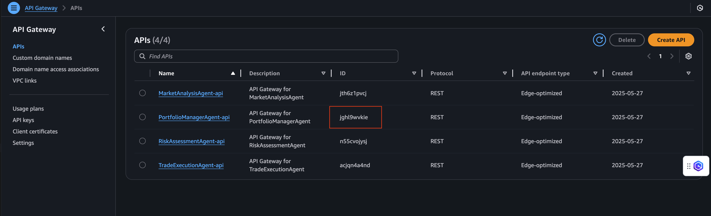
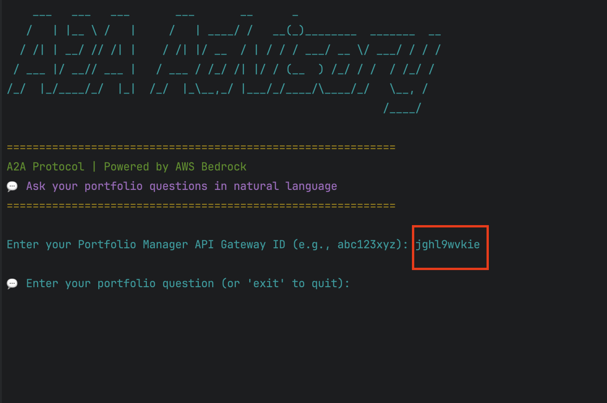

# AWS Solutions Deployment

The application follows a serverless-first architecture deployed on AWS:

1. Infrastructure-as-Code using Terraform
2. Monitoring and observability with CloudWatch

## Table of Content

- [Installation](#installation)
- [Deployment Pre-requisite](#deployment-pre-requisite)
- [Deployment Steps](#deployment-steps)
- [Using the CLI](#using-the-cli)
- [Testing Agents Logic](#testing-agents-logic)
- [Service Quota](#service-quota-for-api-gateway-integration)
- [Solutions Adoption](#solution-adoption)
- [Clean Up](#clean-up)

## Installation

- Clone the repository:

```bash
git clone https://github.com/aws-samples/3P-Agentic-Frameworks.git
```

- Navigate to the project root directory:

```bash
cd 3P-Agentic-Frameworks/a2a-protocol/a2a-advisory-trading
```

## Deployment Pre-requisite

- [AWS CLI v2](https://docs.aws.amazon.com/cli/latest/userguide/getting-started-install.html)
- [Terraform >= 1.8.0](https://developer.hashicorp.com/terraform/tutorials/aws-get-started/install-cli)
- [Git CLI](https://git-scm.com/downloads)
- [Python >= 3.12](https://www.python.org/downloads/)
- [PIP >= 25.0.1](https://pypi.org/project/pip/)
- [make](https://www.gnu.org/software/make/)
- On the Console, make sure Amazon BedRock has enabled access to `Claude 3.5 Haiku`
- Set up Python virtual environment and install dependencies:

```bash
# Create virtual environment
python3 -m venv venv

# Activate virtual environment
# On macOS/Linux:
source venv/bin/activate
# On Windows:
# venv\Scripts\activate

# Install required packages
pip install pyfiglet colorama halo aiohttp boto3
```

- Export environment variables:

```bash
# Copy and update with your values:
export AWS_ACCESS_KEY_ID=your_access_key
export AWS_SECRET_ACCESS_KEY=your_secret_key
export AWS_REGION=your_region
```

- **[Optional]** Setting the environment: In the [Makefile](../../Makefile) of root project, check for the current configuration of the app name, environment name, and region. You may change these configuration; however, make sure that the selected region support the selected model ID of Amazon BedRock

```
##################################################
### Global variables for naming convention
##################################################

APP_NAME ?=adt
ENV_NAME ?=dev
AWS_REGION =us-east-1
```

## Deployment Steps

To deploy the solutions, run the following commands in order at the root project:

```bash
# Deploy core dependencies first (required)
make deploy-core

# Then deploy all agents
make deploy-market-analysis
make deploy-risk-assessment
make deploy-trade-execution
make deploy-portfolio-manager
```

**Command Details:**

- `make deploy-core` - Zip and deploy dependencies into lambda layer, hosted by S3 (Pre-requisite)
- `make deploy-market-analysis` - Deploy market analysis agent
- `make deploy-risk-assessment` - Deploy risk assessment agent
- `make deploy-trade-execution` - Deploy trade execution agent
- `make deploy-portfolio-manager` - Deploy portfolio manager agent

---

To destroy any module, run the following commands:

#### Note: Use these destroy steps to also help with cleaning up resources

```bash
# Destroy agents first
make destroy-portfolio-manager
make destroy-trade-execution
make destroy-risk-assessment
make destroy-market-analysis

# Then destroy core (if needed)
make destroy-core
```

**Command Details:**

- `make destroy-portfolio-manager` - Destroy portfolio manager agent
- `make destroy-trade-execution` - Destroy trade execution agent
- `make destroy-risk-assessment` - Destroy risk assessment agent
- `make destroy-market-analysis` - Destroy market analysis agent
- `make destroy-core` - Clean up temporary files for new layer deployment

---

Once the infrastructure has been set up, run the following command at the project root to start the program:

```bash
# Make sure virtual environment is activated
# On macOS/Linux:
source venv/bin/activate
# On Windows:
# venv\Scripts\activate

# Run the CLI
python cli.py
```

## Using the CLI

**Step 1**: After deployment are completed for all Terraform modules, you can get the Portfolio Manager API ID using one of these methods:

**Option A - Using Terraform (Recommended):**

```bash
# Get the Portfolio Manager API ID from the project root
grep -o "https://[^\"]*execute-api[^\"]*" iac/agents/portfolio_manager/terraform.tfstate | head -1 | cut -d'/' -f3 | cut -d'.' -f1

# Store it as an environment variable for future use
export PORTFOLIO_MANAGER_API_ID=$(grep -o "https://[^\"]*execute-api[^\"]*" iac/agents/portfolio_manager/terraform.tfstate | head -1 | cut -d'/' -f3 | cut -d'.' -f1)
```

**Option B - Using AWS Console:**

- Log into the console > Choose `API Gateway`service
- The list of deployed API IDs will be shown to user



Save or remember the API ID of Portfolio Manager. This is the information you need to start your CLI testing.

**Step 2**: Start the CLI

Navigate to the project root directory: `cd path/to/a2a-advisory-trading`

You can run the CLI in two ways:

**Option A - Using environment variable (Recommended):**

```bash
# If you've set the environment variable
python cli.py

# Or pass it directly
python cli.py $PORTFOLIO_MANAGER_API_ID
```

**Option B - Pass API ID as argument:**

```bash
# Get API ID and run CLI in one command
python cli.py $(grep -o "https://[^\"]*execute-api[^\"]*" iac/agents/portfolio_manager/terraform.tfstate | head -1 | cut -d'/' -f3 | cut -d'.' -f1)

# Or if you already know the API ID
python cli.py xxxxxxxxxx
```

**Option C - Interactive mode:**

```bash
python cli.py
# When prompted, enter the API Gateway ID for the Portfolio Manager service
```



## Testing Agents Logic

### Understanding Agent Interactions

The solution comprises three specialized agents coordinated by the Portfolio Manager (PM). Each agent responds to specific types of queries, and understanding how to formulate your requests will help you get the most effective responses.

Refer to the agent workflow at the [Main page](../../README.md#agent-interactions).

### Testing Different Agents

#### 1. Market Analysis Agent

Best for questions about:

- Industry analysis and trends
- Economic conditions
- Market performance
- Sector outlook

Example queries:

```text
"As a 45-year-old tech professional with $500K in savings, what opportunities do you see in the AI sector?"
"I'm a healthcare worker with $300K to invest. What's the current market situation in biotech?"
"Given my background in renewable energy and $1M investment capacity, analyze the current state of the EV market"
"I'm a small business owner with $750K annual revenue. How are supply chain issues affecting retail investments?"
```

#### 2. Risk Assessment Agent

Best for questions about:

- Investment risk evaluation
- Risk factors analysis
- Market volatility
- Investment safety

Example queries:

```text
"I'm 55 with retirement in 10 years and $2M in savings. What are the risks of investing 30% in tech stocks?"
"As a first-time investor with $100K inheritance, assess the risk level for healthcare investments"
"I have $500K in student loans and $200K to invest. What's my risk profile for cryptocurrency investments?"
"Given my portfolio of 60% real estate and $1.5M liquid assets, evaluate the risk of increasing tech exposure"
```

#### 3. Trade Execution Agent

Requires specific trading instructions:

- Action (Buy/Sell)
- Quantity
- Company symbol

Features:

- One company or industry per request
- Single trading action per execution
- One ticker symbol per trade
- Queries must be IT and finance-related

Example queries:

```text
"Buy 100 shares of AAPL"
"Sell 50 shares of TSLA"
"Purchase 25 shares of AMZN"
```

#### 4. Best Practices for Querying Portfolio Manager

##### Be Specific

- Include relevant details in your queries
- Specify company names or ticker symbols when applicable
  - The agent flow is designed to handle trading intention without specific company name or ticker symbol

##### Complex Queries

- The PM will automatically break down complex requests
- Multiple agents may be engaged sequentially
- Results will be compiled into a comprehensive response

##### Query Structure

- Start with clear intent (analyze, assess risk, trade)
- Provide context (industry, company, market conditions)
- Include specific parameters when needed

### Example Workflows

#### Scenario 1: Personalized Investment Recommendation with Trade Intent

User query: "I'm a 35-year-old software engineer with 500,000 USD in savings and 200,000 USD in stock options. I want to invest in the best performing oil company given my risk tolerance."

Workflow:

- PM receives and analyzes the request, including user profile and risk context
- PM first sends the request with user profile to Market Analysis
- Market Analysis agent:
  - Evaluates oil company performance
  - Considers user's tech-heavy portfolio
  - Analyzes top candidates for portfolio diversification
  - Returns the ticker symbol of the most suitable company
- PM receives response and sends request to Risk Assessment with user profile
- Risk Assessment agent:
  - Analyzes investment risk for the selected company
  - Evaluates risk against user's current portfolio
  - Considers age and existing stock options exposure
  - Provides personalized risk assessment
- PM reflects on the request and user's trade intention
- PM returns comprehensive results including:
  - Market analysis with diversification strategy
  - Risk assessment tailored to user profile
  - Specific investment recommendations
- Trade Execution agent processes trade order if user approves

#### Scenario 2: Comprehensive Industry Analysis Without Trade Intent

User query: "As a 50-year-old medical professional with 2M USD in retirement accounts and 500,000 USD in private practice revenue, what is the current geopolitical, economic, and risk situation of investing in the healthcare industry?"

Workflow:

- PM receives and analyzes the request, noting:
  - User's industry expertise
  - Significant retirement assets
  - Professional stake in healthcare
- PM delegates tasks asynchronously to both agents:
  - Market Analysis agent evaluates:
    - Industry trends considering user's insider perspective
    - Economic factors affecting healthcare
    - Potential conflicts with user's practice revenue
  - Risk Assessment agent analyzes:
    - Age-appropriate risk factors
    - Portfolio concentration risks
    - Professional exposure considerations
- PM consolidates and returns personalized insights:
  - Industry analysis aligned with user's background
  - Risk assessment considering dual exposure
  - Strategic recommendations for portfolio balance

### Service Quota for API Gateway Integration

Amazon API Gateway has a default maximum integration timeout of 29 seconds (29,000 milliseconds). While this limit can be increased through service quota requests, our solution has been architected to operate efficiently within this constraint through careful optimization. We have implemented asynchronous operations where possible and selected lightweight foundation model to ensure rapid response times while maintaining high-quality outputs.

For most standard use cases with well-defined, concise inputs, you should experience smooth operation with minimal to no throttling of the agent processes. Our system performs optimally with focused queries and clear user profile contexts that maintain reasonable token counts.

However, if you plan to process extensive user profile data, handle complex multi-part queries, or require comprehensive market analysis, you may need to request a service quota increase. This is particularly relevant when dealing with large context windows or detailed market analyses.

### Solution Adoption

Organizations adopting this solution should establish proper security protocols including but not limited to guardrails, unit testing, integration testing, and encryption. Adopters must follow engineering best practices and implement secure LLM training practices with their own domain-specific data to ensure relevancy and accuracy.

### Clean Up

To clean up, make sure that you have deleted all the resources by running `make destroy-{resource}` commands. Refer to [the clean up steps](#note-use-these-destroy-steps-to-also-help-with-cleaning-up-resources) above for details. 