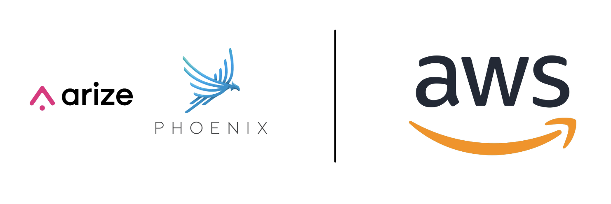

## Arize Phoenix 


Phoenix (from Arize) is an open-source AI observability platform designed for experimentation, evaluation, and troubleshooting. It allows AI engineers and data scientists to quickly visualize their data, evaluate performance, track down issues, and export data to improve.

## Arize Phoenix Official Documentation

**Docs:** https://arize.com/docs/phoenix

## Arize + AWS

**Bedrock Agents Configuration with Arize Phoenix:** 

```python
pip install openinference-instrumentation-bedrock

from phoenix.otel import register

# configure the Phoenix tracer
tracer_provider = register(
  project_name="my-llm-app", # Default is 'default'
  auto_instrument=True # Auto-instrument your app based on installed OI dependencies
)

import boto3

session = boto3.session.Session()
client = session.client("bedrock-runtime")

session_id = f"default-session1_{int(time.time())}"

attributes = dict(
    inputText=input_text,
    agentId=AGENT_ID,
    agentAliasId=AGENT_ALIAS_ID,
    sessionId=session_id,
    enableTrace=True,
)
response = client.invoke_agent(**attributes)

```
