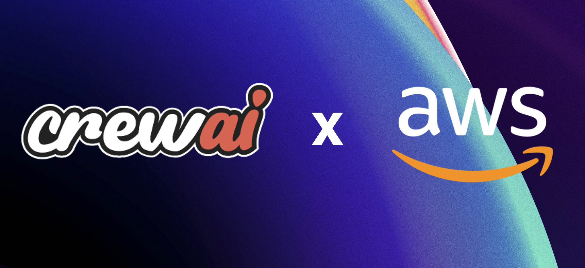

## CrewAI 


CrewAI, a Python-based open-source framework, simplifies the creation and management of multi-agent systems, enabling agents to work together seamlessly, tackling complex tasks through collaborative intelligence.

## CrewAI Official Documentation

**Docs:** https://docs.crewai.com/introduction 

## CrewAI + AWS

### [AWS Security Auditor Crew](aws-security-auditor-crew)
A specialized crew that performs comprehensive security audits of AWS infrastructure, analyzes configurations, and generates detailed reports using Claude 3 Sonnet via Amazon Bedrock.

### [Compliance Assistant Crew](https://github.com/aws-samples/sample-compliance-assistant-with-agents)
A dedicated crew that automates compliance tasks by monitoring regulatory changes from Amazon Bedrock Knowledge Bases, generating policies, and generating technical controls using Amazon Nova Pro via Amazon Bedrock.

### Importing LLMs from Amazon Bedrock

**Model IDs Supported:** https://docs.aws.amazon.com/bedrock/latest/userguide/models-supported.html

**LLM Configuration:** 

```python
AWS_ACCESS_KEY_ID=<your-access-key>
AWS_SECRET_ACCESS_KEY=<your-secret-key>
AWS_DEFAULT_REGION=<your-region>

llm = LLM(
    model="bedrock/{model-id}"
)
```
