# AI Agents on Amazon EKS

A production-ready framework for deploying AI agents on Amazon EKS using Strands Agents, Model Context Protocol (MCP), and Amazon Bedrock. This project demonstrates how to build, deploy, and scale intelligent agents in a cloud-native environment.

## Architecture

```mermaid
graph TB
    subgraph "End Users"
        USER[Web Browser<br/>OAuth Login]
    end

    subgraph "AWS Cloud"
        subgraph "Amazon EKS Cluster"
            subgraph "UI Namespace"
                UI[Agent UI<br/>FastAPI + Gradio<br/>Port: 8000]
            end
            
            subgraph "Agents Namespace"
                WA[Weather Agent ✅<br/>MCP:8080 A2A:9000 REST:3000]
                TA[Travel Agent 🚧<br/>Multi-Agent Coordinator]
                AA[Activities Agent 🚧<br/>Local Recommendations]
            end
            
            subgraph "MCP Servers Namespace"
                WM[Weather MCP Server<br/>Forecast & Alert Tools<br/>Port: 8080]
                TM[Travel MCP Server 🚧<br/>Planning Tools]
                AM[Activities MCP Server 🚧<br/>Recommendation Tools]
            end
        end

        subgraph "AWS Services"
            ECR[Amazon ECR<br/>Container Images]
            COGNITO[Amazon Cognito<br/>OAuth Authentication]
            BEDROCK[Amazon Bedrock<br/>Claude 3.7 Sonnet]
            S3[Amazon S3<br/>Session Storage]
        end
    end

    %% User interactions
    USER -->|HTTPS + OAuth| UI
    
    %% UI to Agents
    UI -->|REST API| WA
    UI -.->|REST API| TA
    UI -.->|REST API| AA
    
    %% Agent to MCP communication
    WA -->|MCP Protocol| WM
    TA -.->|MCP Protocol| TM
    AA -.->|MCP Protocol| AM
    
    %% Agent to Agent communication
    TA -.->|A2A Protocol| WA
    TA -.->|A2A Protocol| AA
    
    %% AWS service connections
    WA -->|Invoke LLM| BEDROCK
    TA -.->|Invoke LLM| BEDROCK
    AA -.->|Invoke LLM| BEDROCK
    
    UI -->|Session Data| S3
    UI -->|Authentication| COGNITO
    
    %% Container registry
    ECR -.->|Pull Images| UI
    ECR -.->|Pull Images| WA
    ECR -.->|Pull Images| WM

    classDef ready fill:#4CAF50,stroke:#2E7D32,stroke-width:2px,color:#fff
    classDef coming fill:#FF9800,stroke:#F57C00,stroke-width:2px,color:#fff
    classDef aws fill:#FF9900,stroke:#232F3E,stroke-width:2px,color:#fff
    classDef user fill:#2196F3,stroke:#1976D2,stroke-width:2px,color:#fff

    class WA,WM,UI ready
    class TA,AA,TM,AM coming
    class ECR,COGNITO,BEDROCK,S3 aws
    class USER user
```



The framework supports multiple AI agents that can work independently or collaborate together:

- **Weather Agent** - Provides weather forecasts and alerts (✅ Ready)
- **Travel Agent** - Coordinates travel planning with other agents (🚧 Coming Soon)
- **Activities Agent** - Recommends local activities and attractions (🚧 Coming Soon)

Each agent supports three communication protocols:
- **MCP (Model Context Protocol)** - For tool integration
- **A2A (Agent-to-Agent)** - For inter-agent communication  
- **REST API** - For web application integration

## Quick Start

### Prerequisites

- AWS CLI configured with appropriate permissions
- Docker with buildx support
- Helm v3.0+
- kubectl v1.28+
- Access to Amazon Bedrock Claude 3.7 Sonnet model

### Deploy Infrastructure

```bash
cd infrastructure/terraform/
terraform init
terraform apply
```

### Deploy Weather Agent (Ready to Use)

The weather agent is fully implemented and ready for deployment:

```bash
# Setup environment
./scripts/terraform-prep-env-weather-agent.sh
./scripts/terraform-prep-env-weather-ui.sh

# Deploy the complete weather agent system
cd agents/weather/
# Follow the deployment guide in the weather agent README
```

**[→ Weather Agent Deployment Guide](agents/weather/README.md)**

## Project Structure

```
├── agents/                    # AI Agent implementations
│   ├── weather/              # Weather forecasting agent (Ready)
│   ├── travel/               # Travel planning agent (Coming Soon)
│   └── activities/           # Activities recommendation agent (Coming Soon)
├── infrastructure/           # Infrastructure as Code
│   ├── terraform/           # AWS infrastructure deployment
│   └── cdk/                 # Alternative CDK implementation
├── manifests/               # Kubernetes deployment manifests
│   └── helm/               # Helm charts for agents and UI
├── ui/                     # Web-based agent interface
└── scripts/                # Deployment automation scripts
```

## Available Agents

### Weather Agent ✅
Fully functional weather agent providing forecasts and alerts for US locations.

**Features:**
- 3-day weather forecasts
- Weather alerts by state
- Outdoor activity recommendations
- Multi-protocol support (MCP/A2A/REST)

**[→ Get Started with Weather Agent](agents/weather/README.md)**

### Travel Agent 🚧
Multi-agent travel planning system that coordinates with weather and activities agents.

**Planned Features:**
- Personalized itinerary creation
- Weather-aware activity scheduling
- Multi-day trip planning
- Agent collaboration workflows

**[→ Learn About Travel Agent](agents/travel/README.md)**

### Activities Agent 🚧
Local activities and attractions recommendation system.

**Planned Features:**
- Indoor/outdoor activity classification
- Operating hours and pricing
- Location-based recommendations
- Integration with travel planning

**[→ Learn About Activities Agent](agents/activities/README.md)**

## Infrastructure

### Terraform Deployment

The infrastructure includes:
- Amazon EKS cluster with managed node groups
- Amazon ECR repositories for container images
- Amazon Cognito for authentication
- IAM roles and policies for Bedrock access
- VPC and networking components

**Deployment Scripts:**
- `scripts/terraform-prep-env-weather-agent.sh` - Weather agent environment setup
- `scripts/terraform-prep-env-weather-ui.sh` - UI environment setup

### Kubernetes Manifests

Helm charts provide production-ready deployments with:
- Multi-protocol agent services
- Horizontal pod autoscaling
- Health checks and monitoring
- OAuth-based authentication

## Web Interface

The included web UI provides:
- OAuth authentication via Amazon Cognito
- Multi-agent chat interface
- Session management
- Responsive design for mobile and desktop

Access the UI after deployment at the configured endpoint with default credentials:
- Username: `Alice`
- Password: `Passw0rd@`

## Development

For local development and testing:

**[→ Contributing Guide](CONTRIBUTING.md)**

## Support

- **Issues**: Check individual agent README files for troubleshooting
- **Architecture**: Review the infrastructure terraform configurations
- **Development**: See the contributing guide for local setup

## License

This project is provided as sample code for educational and demonstration purposes.
