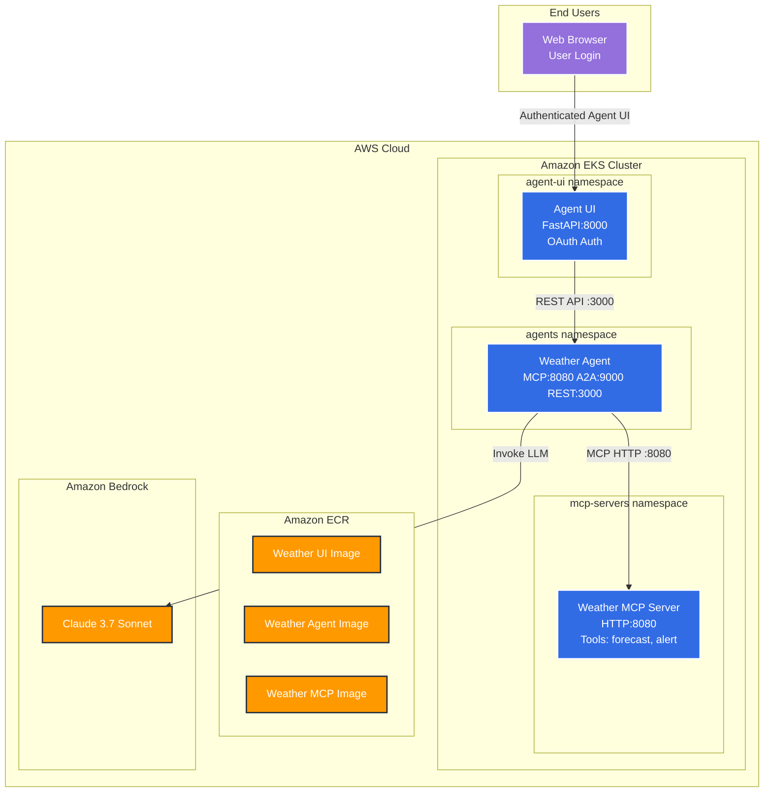
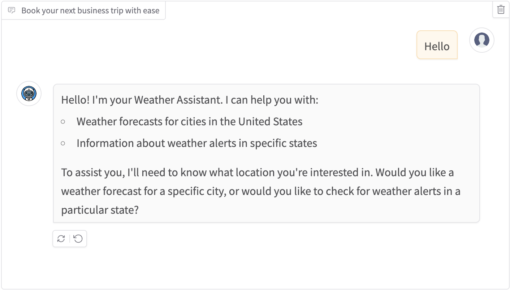
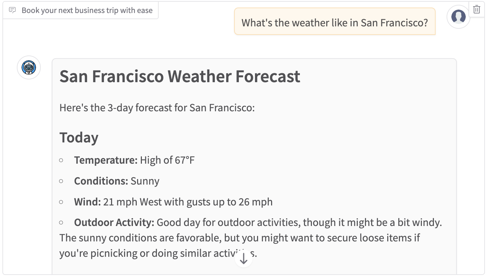

# Weather Agent Overview

This implementation provides a weather-focused AI agent that processes natural language requests for weather information and alerts.

A generic AI agent framework built with Strands Agents, MCP (Model Context Protocol), A2A (Agent to Agent), and FastAPI. Configurable for any domain including weather forecasts, financial analysis, customer service, and more.

### Agent Capabilities
- Current weather conditions
- Weather forecasts
- Weather alerts
- Temperature information
- Weather-related recommendations

### Example Interactions

Input Prompt:
```
What's the weather like in San Francisco?
```

Expected Response Format:
```
As the Weather Agent, I've checked the current conditions for San Francisco:

Current Weather:
- Temperature: 62°F
- Conditions: Partly Cloudy
- Humidity: 75%
- Wind: 12 mph from the West

Today's Forecast:
- High: 68°F
- Low: 54°F
- Conditions: Morning fog clearing to partly cloudy
- Precipitation Chance: 10%

Notable Conditions:
- Morning fog expected until 11 AM
- Clear conditions in the afternoon
- Light breeze throughout the day
```


## Example

Deploy a complete AI agent system with Agent UI, Agent Service, and MCP Server to Amazon EKS in just a few steps.

### Prerequisites

- [AWS CLI](https://aws.amazon.com/cli/) (v2.0 or later)
- [Docker](https://docs.docker.com/get-docker/) with buildx support
- [Helm](https://helm.sh/docs/intro/install/) (v3.0 or later)
- [kubectl](https://kubernetes.io/docs/tasks/tools/) (v1.28 or later)
- Enable a model that support tool callig, see [Supported models and model features](https://docs.aws.amazon.com/bedrock/latest/userguide/conversation-inference-supported-models-features.html). For this example, request model access for **Claude 3.7 Sonnet** in the [AWS Bedrock Console](https://console.aws.amazon.com/bedrock/home#/modelaccess)

**Required AWS Permissions:**
- EKS cluster creation and management
- IAM role and policy management
- ECR repository management
- Amazon Bedrock access

### Architecture Overview



**Key Components:**
- **Agent UI**: FastAPI-based frontend with OAuth authentication (port 8000)
- **Agent Service**: Triple protocol support - MCP (8080), A2A (9000), REST API (3000)
- **MCP Server**: Dedicated weather tools server providing forecast/alert capabilities (port 8080)
- **Security**: EKS Pod Identity for Bedrock access, OAuth JWT validation for user authentication


## Agent Code

Open the Agent code, go to line 162
```bash
code -g src/agent.py:162:9
```

This is how an Agent gets created:
```python
        agent = Agent(
            name=agent_name,
            description=agent_description,
            model=bedrock_model,
            system_prompt=system_prompt,
            tools=[agent_tools]+mcp_tools,
            messages=messages,
            conversation_manager=conversation_manager
        )
```


## Deployment Steps


### 1. Environment Setup

Run all commands from the `agents/weather/` directory
```bash
cd agents/weather/
```

Set up the required environment variables:

```bash
# AWS Configuration
export AWS_ACCOUNT_ID=$(aws sts get-caller-identity --query 'Account' --output text)
export AWS_REGION=us-west-2

# EKS Cluster Configuration
export CLUSTER_NAME=agentic-ai-on-eks

# Kubernetes Configuration
export KUBERNETES_APP_WEATHER_MCP_NAMESPACE=mcp-servers
export KUBERNETES_APP_WEATHER_MCP_NAME=weather-mcp

export KUBERNETES_APP_WEATHER_AGENT_NAMESPACE=agents
export KUBERNETES_APP_WEATHER_AGENT_NAME=weather-agent

export KUBERNETES_APP_AGENT_UI_NAMESPACE=ui
export KUBERNETES_APP_AGENT_UI_NAME=agent-ui
export KUBERNETES_APP_AGENT_UI_SECRET_NAME=agent-ui

# ECR Configuration
export ECR_REPO_HOST=${AWS_ACCOUNT_ID}.dkr.ecr.${AWS_REGION}.amazonaws.com

export ECR_REPO_WEATHER_MCP_NAME=agents-on-eks/weather-mcp
export ECR_REPO_WEATHER_MCP_URI=${ECR_REPO_HOST}/${ECR_REPO_WEATHER_MCP_NAME}

export ECR_REPO_WEATHER_AGENT_NAME=agents-on-eks/weather-agent
export ECR_REPO_WEATHER_AGENT_URI=${ECR_REPO_HOST}/${ECR_REPO_WEATHER_AGENT_NAME}

export ECR_REPO_AGENT_UI_NAME=agents-on-eks/agent-ui
export ECR_REPO_AGENT_UI_URI=${ECR_REPO_HOST}/${ECR_REPO_AGENT_UI_NAME}

# Amazon Bedrock Configuration
export BEDROCK_MODEL_ID=global.anthropic.claude-haiku-4-5-20251001-v1:0
```

> **Note:** Make sure you have access to the Amazon Bedrock model in your AWS account.

### 2. Create EKS Cluster

Deploy the infrastructure using Terraform:

```bash
cd ../../infrastructure/terraform/
terraform init
terraform apply
../../scripts/terraform-prep-env-weather-agent.sh
../../scripts/terraform-prep-env-weather-agent.sh
cd -
```

Review the new EKS cluster in the console by visiting the [AWS EKS Console](https://console.aws.amazon.com/eks/home)

### 3. Build and Push All Three Images

Authenticate with ECR:

```bash
# Authenticate with ECR
aws ecr get-login-password --region ${AWS_REGION} | \
  docker login --username AWS --password-stdin ${ECR_REPO_HOST}
```

Build and push all three images:

```bash
# Build and push MCP Server
docker build --platform linux/amd64 -t ${ECR_REPO_WEATHER_MCP_URI}:latest mcp-servers/weather-mcp-server
docker push ${ECR_REPO_WEATHER_MCP_URI}:latest

# Build and push Agent Service
docker build --platform linux/amd64 -t ${ECR_REPO_WEATHER_AGENT_URI}:latest .
docker push ${ECR_REPO_WEATHER_AGENT_URI}:latest

# Build and push Agent UI
docker build --platform linux/amd64 -t ${ECR_REPO_AGENT_UI_URI}:latest ../../ui
docker push ${ECR_REPO_AGENT_UI_URI}:latest
```

Review the new images cluster in the console by visiting the [AWS ECR Console](https://console.aws.amazon.com/ecr/private-registry/repositories)

### 4. Deploy All Three Services

Make sure you setup kubeconfig:
```bash
aws eks update-kubeconfig --name ${CLUSTER_NAME} --region ${AWS_REGION}
```

Deploy the MCP Server:
```bash
# Deploy the MCP Server
helm upgrade ${KUBERNETES_APP_WEATHER_MCP_NAME} ../../manifests/helm/mcp \
  --install \
  --namespace ${KUBERNETES_APP_WEATHER_MCP_NAMESPACE} \
  --create-namespace \
  -f ../../manifests/helm/mcp/workshop-mcp-weather-values.yaml

# Wait for MCP server to be ready
kubectl rollout status deployment ${KUBERNETES_APP_WEATHER_MCP_NAME} \
  --namespace ${KUBERNETES_APP_WEATHER_MCP_NAMESPACE}
```

Deploy the Agent Service:
```bash
# Deploy the Agent
helm upgrade ${KUBERNETES_APP_WEATHER_AGENT_NAME} ../../manifests/helm/agent \
  --install \
  --namespace ${KUBERNETES_APP_WEATHER_AGENT_NAMESPACE} \
  --create-namespace \
  -f ../../manifests/helm/agent/workshop-agent-weather-values.yaml

# Wait for Agent to be ready
kubectl rollout status deployment ${KUBERNETES_APP_WEATHER_AGENT_NAME} \
  --namespace ${KUBERNETES_APP_WEATHER_AGENT_NAMESPACE}
```

Deploy the Agent UI:
```bash
# Create OAuth secret for the Agent UI
kubectl create ns ${KUBERNETES_APP_AGENT_UI_NAMESPACE} 2>/dev/null || true
kubectl delete secret ${KUBERNETES_APP_AGENT_UI_SECRET_NAME} \
  --namespace ${KUBERNETES_APP_AGENT_UI_NAMESPACE} 2>/dev/null || true
kubectl create secret generic ${KUBERNETES_APP_AGENT_UI_SECRET_NAME} \
  --namespace ${KUBERNETES_APP_AGENT_UI_NAMESPACE} \
  --from-env-file ../../ui/.env

# Deploy the Agent UI
helm upgrade ${KUBERNETES_APP_AGENT_UI_NAME} ../../manifests/helm/ui \
  --install \
  --namespace ${KUBERNETES_APP_AGENT_UI_NAMESPACE} \
  --create-namespace \
  -f ../../manifests/helm/ui/workshop-ui-values.yaml


# Wait for Agent UI to be ready
kubectl rollout status deployment ${KUBERNETES_APP_AGENT_UI_NAME} \
  --namespace ${KUBERNETES_APP_AGENT_UI_NAMESPACE}
```

Review the 3 pods running (MCP, Agent, UI) or go to [AWS EKS Console Resource view](https://console.aws.amazon.com/eks/clusters/agentic-ai-on-eks?&selectedResourceId=pods&selectedTab=cluster-resources-tab)

Or check in the terminal
```bash
kubectl get pods -n mcp-servers
kubectl get pods -n agents
kubectl get pods -n ui
```
Expected output should look like this, all pods in `Running` status:
```
NAME                            READY   STATUS    RESTARTS   AGE
weather-mcp-885867d86-w9986     1/1     Running   0          80s

NAME                            READY   STATUS    RESTARTS   AGE
weather-agent-97b7bfb55-7q8fs   1/1     Running   0          92s

NAME                            READY   STATUS    RESTARTS   AGE
agent-ui-6f4c6d889-r442z        1/1     Running   0          44s
```

### 5. Access the Weather Agent UI

The included UI provides:
- OAuth authentication via Amazon Cognito
- Multi-agent chat interface
- Session management
- Responsive design for mobile and desktop

Access the UI after deployment at the configured endpoint with default credentials:
- Username: `Alice`
- Password: `Passw0rd@`

Run Kubectl Port forward the Agent UI and access it:
```bash
kubectl  port-forward svc/${KUBERNETES_APP_AGENT_UI_NAME} \
  --namespace ${KUBERNETES_APP_AGENT_UI_NAMESPACE} \
  8000:fastapi
```

From another terminal open the Browser with the corresponding URL

If running this lab from a workshop environment get the Agent url and open with this command:
```bash
python3 -m webbrowser "$IDE_URL/proxy/8000/"
```
If you not in workshop studio and instead running locally on your on your developer computer then use localhost
```bash
python3 -m webbrowser "http://localhost:8000/chat/"
```


Say hello to the weather to see what how the Agent can help you, hit enter to send the prompt to the Agent.
```bash
Hello
```



Ask the agent the following question:
```prompt
What's the weather like in San Francisco?
```


Check the agent logs in different terminal
```bash
kubectl logs -n ${KUBERNETES_APP_WEATHER_AGENT_NAMESPACE} deploy/${KUBERNETES_APP_WEATHER_AGENT_NAME} -f
```

Ask another question about alerts (a different tool), without specifying the city or state, the Agent remembers the state location from the first message.
```prompt
Any weather alerts for this state?
```




## Agent Configuration

The weather agent's behavior is defined in the `agent.md` file when running locally with `uv run` and in the helm values file [../../manifests/helm/agent/values.yaml](../../manifests/helm/agent/values.yaml) when running in EKS.

The tools for the agent are defined in mcp.json in the helm values file [../../manifests/helm/agent/mcp-remote.yaml](../../manifests/helm/agent/mcp-remote.yaml) to use remote mcp servers, by the default it will use the embedded mcp server enabled in the default [../../manifests/helm/agent/values.yaml](../../manifests/helm/agent/values.yaml) file.

The configuration includes:
- **Agent Name**: Display name for the agent
- **Agent Description**: Brief description of capabilities
- **System Prompt**: Instructions defining behavior and expertise

## Clean Up Resources

When you're done, clean up to avoid charges:

```bash
# Uninstall applications
helm uninstall ${KUBERNETES_APP_AGENT_UI_NAME} \
  --namespace ${KUBERNETES_APP_AGENT_UI_NAMESPACE}
helm uninstall ${KUBERNETES_APP_WEATHER_AGENT_NAME} \
  --namespace ${KUBERNETES_APP_WEATHER_AGENT_NAMESPACE}
helm uninstall ${KUBERNETES_APP_WEATHER_MCP_NAME} \
  --namespace ${KUBERNETES_APP_WEATHER_MCP_NAMESPACE}
```

Delete EKS cluster (via Terraform)
```bash
cd ../../infrastructure/terraform/
terraform destroy
cd -
```

## Next Steps

- **Development**: See [CONTRIBUTING.md](../CONTRIBUTING.md) for local development setup
- **Customization**: Modify `agent.md` to create domain-specific agents
- **Monitoring**: Add CloudWatch logging and metrics for production deployments

## Support

For issues and questions:
- Check the troubleshooting section in [CONTRIBUTING.md](CONTRIBUTING.md)
- Review pod logs: `kubectl logs deployment/<deployment-name>`
- Verify service endpoints: `kubectl get endpoints`
