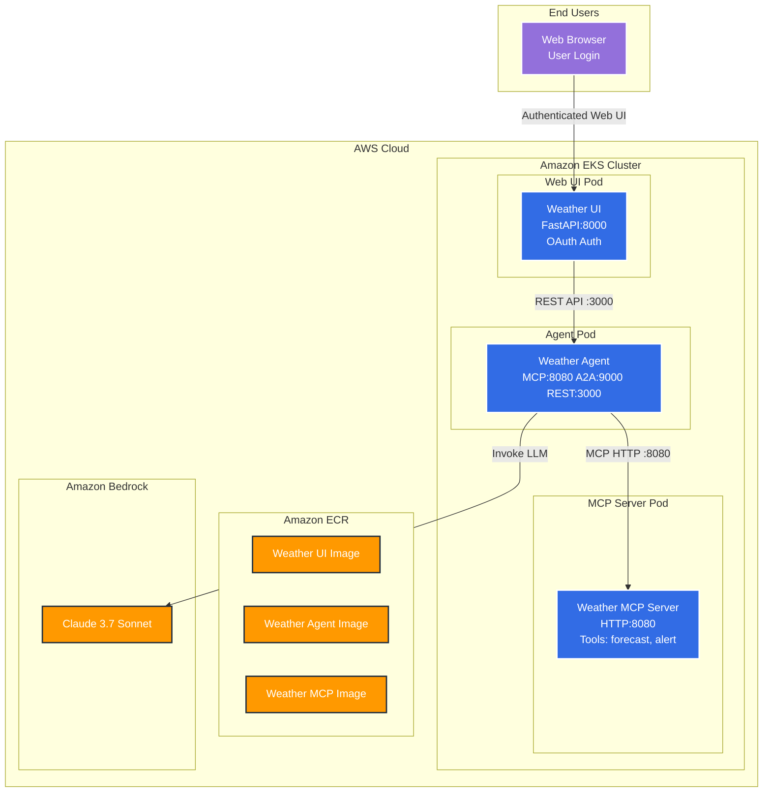

# AI Agents on EKS

A generic AI agent framework built with Strands Agents, MCP (Model Context Protocol), A2A (Agent to Agent), and FastAPI. Configurable for any domain including weather forecasts, financial analysis, customer service, and more.

## Example

Deploy a complete AI agent system with Web UI, Agent Service, and MCP Server to Amazon EKS in just a few steps.

### Prerequisites

- [AWS CLI](https://aws.amazon.com/cli/) (v2.0 or later)
- [Docker](https://docs.docker.com/get-docker/) with buildx support
- [Helm](https://helm.sh/docs/intro/install/) (v3.0 or later)
- [kubectl](https://kubernetes.io/docs/tasks/tools/) (v1.28 or later)
- Enable a model that support tool callig, see [Supported models and model features](https://docs.aws.amazon.com/bedrock/latest/userguide/conversation-inference-supported-models-features.html). For this example, request model access for **Claude 3.7 Sonnet** in the [AWS Bedrock Console](https://console.aws.amazon.com/bedrock/home#/modelaccess)

**Required AWS Permissions:**
- EKS cluster creation and management
- IAM role and policy management
- ECR repository management
- Amazon Bedrock access

### Architecture Overview



**Key Components:**
- **Web UI**: FastAPI-based frontend with OAuth authentication (port 8000)
- **Agent Service**: Triple protocol support - MCP (8080), A2A (9000), REST API (3000)
- **MCP Server**: Dedicated weather tools server providing forecast/alert capabilities (port 8080)
- **Multi-Architecture**: AMD64 support for all three services
- **Security**: EKS Pod Identity for Bedrock access, OAuth JWT validation


## Agent Code

Open the Agent code, go to line 162
```bash
code -g src/agent.py:162:9
```

This is how an Agent gets created:
```python
        agent = Agent(
            name=agent_name,
            description=agent_description,
            model=bedrock_model,
            system_prompt=system_prompt,
            tools=[agent_tools]+mcp_tools,
            messages=messages,
            conversation_manager=conversation_manager
        )
```


## Deployment Steps

### 1. Environment Setup

Set up the required environment variables:

```bash
# AWS Configuration
export AWS_ACCOUNT_ID=$(aws sts get-caller-identity --query 'Account' --output text)
export AWS_REGION=us-west-2

# EKS Cluster Configuration
export CLUSTER_NAME=agentic-ai-on-eks

# Kubernetes Configuration
export KUBERNETES_APP_WEATHER_MCP_NAMESPACE=weather-agent
export KUBERNETES_APP_WEATHER_MCP_NAME=weather-mcp

export KUBERNETES_APP_WEATHER_AGENT_NAMESPACE=weather-agent
export KUBERNETES_APP_WEATHER_AGENT_NAME=weather-agent

export KUBERNETES_APP_WEATHER_AGENT_UI_NAMESPACE=agent-ui
export KUBERNETES_APP_WEATHER_AGENT_UI_NAME=agent-ui
export KUBERNETES_APP_WEATHER_AGENT_UI_SECRET_NAME=agent-ui

# ECR Configuration
export ECR_REPO_HOST=${AWS_ACCOUNT_ID}.dkr.ecr.${AWS_REGION}.amazonaws.com
export ECR_REPO_MCP_NAME=agents-on-eks/weather-mcp
export ECR_REPO_WEATHER_MCP_URI=${ECR_REPO_HOST}/${ECR_REPO_MCP_NAME}
export ECR_REPO_NAME=agents-on-eks/weather-agent
export ECR_REPO_WEATHER_AGENT_URI=${ECR_REPO_HOST}/${ECR_REPO_NAME}
export ECR_REPO_UI_NAME=agents-on-eks/weather-agent-ui
export ECR_REPO_WEATHER_AGENT_UI_URI=${ECR_REPO_HOST}/${ECR_REPO_UI_NAME}

# Amazon Bedrock Configuration
export BEDROCK_MODEL_ID=us.anthropic.claude-3-7-sonnet-20250219-v1:0
```

> **Note:** Make sure you have access to the Amazon Bedrock model in your AWS account.

### 2. Create EKS Cluster

Deploy the infrastructure using Terraform:

```bash
cd ../terraform
terraform apply
./prep-env-weather-agent.sh
./prep-env-weather-web.sh
cd -
```

Review the new EKS cluster in the console by visiting the [AWS EKS Console](https://console.aws.amazon.com/eks/home)

### 3. Build and Push All Three Images

Authenticate with ECR:

```bash
# Authenticate with ECR
aws ecr get-login-password --region ${AWS_REGION} | \
  docker login --username AWS --password-stdin ${ECR_REPO_HOST}
```

Build and push all three images:

```bash
# Build and push MCP Server
docker build --platform linux/amd64 \
  -t ${ECR_REPO_WEATHER_MCP_URI}:latest \
  mcp-servers/weather-mcp-server
docker push ${ECR_REPO_WEATHER_MCP_URI}:latest

# Build and push Agent Service
docker build --platform linux/amd64 \
  -t ${ECR_REPO_WEATHER_AGENT_URI}:latest \
  .
docker push ${ECR_REPO_WEATHER_AGENT_URI}:latest

# Build and push Web UI
docker build --platform linux/amd64 \
  -t ${ECR_REPO_WEATHER_AGENT_UI_URI}:latest \
  web
docker push ${ECR_REPO_WEATHER_AGENT_UI_URI}:latest
```

Review the new images cluster in the console by visiting the [AWS ECR Console](https://console.aws.amazon.com/ecr/private-registry/repositories)

### 4. Deploy All Three Services

Deploy the MCP Server:
```bash
helm upgrade ${KUBERNETES_APP_WEATHER_MCP_NAME} mcp-servers/weather-mcp-server/helm --install \
  --namespace ${KUBERNETES_APP_WEATHER_MCP_NAMESPACE} --create-namespace \
  --set image.repository=${ECR_REPO_WEATHER_MCP_URI}

# Wait for MCP server to be ready
kubectl -n ${KUBERNETES_APP_WEATHER_MCP_NAMESPACE} \
  rollout status deployment/${KUBERNETES_APP_WEATHER_MCP_NAME}
```

Deploy the Agent Service:
```bash
# Load agent environment variables
source .env

# Deploy the weather agent
helm upgrade ${KUBERNETES_APP_WEATHER_AGENT_NAME} helm --install \
  --namespace ${KUBERNETES_APP_WEATHER_AGENT_NAMESPACE} --create-namespace \
  --set image.repository=${ECR_REPO_WEATHER_AGENT_URI} \
  --set env.DYNAMODB_AGENT_STATE_TABLE_NAME=${DYNAMODB_AGENT_STATE_TABLE_NAME} \
  --set env.OAUTH_JWKS_URL=${OAUTH_JWKS_URL} \
  -f helm/mcp-remote.yaml

# Wait for agent to be ready
kubectl -n ${KUBERNETES_APP_WEATHER_AGENT_NAMESPACE} \
  rollout status deployment/${KUBERNETES_APP_WEATHER_AGENT_NAME}
```

Deploy the Web UI:
```bash
# Load UI environment variables
source web/.env

# Create OAuth secret
kubectl create secret generic ${KUBERNETES_APP_WEATHER_AGENT_UI_SECRET_NAME} \
  --from-literal=OAUTH_CLIENT_ID=${OAUTH_CLIENT_ID} \
  --from-literal=OAUTH_CLIENT_SECRET=${OAUTH_CLIENT_SECRET} \
  --from-literal=OAUTH_SIGNIN_URL=${OAUTH_SIGNIN_URL} \
  --from-literal=OAUTH_LOGOUT_URL=${OAUTH_LOGOUT_URL} \
  --from-literal=OAUTH_WELL_KNOWN_URL=${OAUTH_WELL_KNOWN_URL} \
  --from-literal=OAUTH_JWKS_URL=${OAUTH_JWKS_URL} \
  --namespace ${KUBERNETES_APP_WEATHER_AGENT_UI_NAMESPACE}

# Deploy the web UI
helm upgrade ${KUBERNETES_APP_WEATHER_AGENT_UI_NAME} web/helm --install \
  --namespace ${KUBERNETES_APP_WEATHER_AGENT_UI_NAMESPACE} --create-namespace \
  --set secret.name=${KUBERNETES_APP_WEATHER_AGENT_UI_SECRET_NAME} \
  --set image.repository=${ECR_REPO_WEATHER_AGENT_UI_URI} \
  --set env.AGENT_UI_ENDPOINT_URL_1="http://${KUBERNETES_APP_WEATHER_AGENT_NAME}.${KUBERNETES_APP_WEATHER_AGENT_NAMESPACE}/prompt"

# Wait for UI to be ready
kubectl -n ${KUBERNETES_APP_WEATHER_AGENT_UI_NAMESPACE} \
  rollout status deployment/${KUBERNETES_APP_WEATHER_AGENT_UI_NAME}
```

Review the 3 pods running (MCP, Agent, UI) or go to [AWS EKS Console Resource view](https://console.aws.amazon.com/eks/clusters/agentic-ai-on-eks?&selectedResourceId=pods&selectedTab=cluster-resources-tab)

Or check in the terminal
```bash
kubectl get pods -A
```

### 5. Access the Weather Agent UI

Port forward the Web UI and access it:

```bash
kubectl --namespace ${KUBERNETES_APP_WEATHER_AGENT_UI_NAMESPACE} \
  port-forward svc/${KUBERNETES_APP_WEATHER_AGENT_UI_NAME} 8000:fastapi
```

Open http://localhost:8000/chat in your browser.

Login with:
- **Username**: `Alice`
- **Password**: `Passw0rd@`

Try asking: **"What's the weather like in San Francisco?"**

Check the agent logs
```bash
kubectl logs -n {KUBERNETES_APP_WEATHER_AGENT_NAMESPACE} deploy/${KUBERNETES_APP_WEATHER_AGENT_NAME} -f
```

You can ask another question about weather forecast or alerts, without specifying the city, since the Agent remembers.
```prompt
Any weather alerts?
```

Check that all services are running:

```bash
# Check MCP Server
kubectl -n ${KUBERNETES_APP_WEATHER_MCP_NAMESPACE} \
  get pods -l app.kubernetes.io/instance=${KUBERNETES_APP_WEATHER_MCP_NAME}

# Check Agent Service
kubectl -n ${KUBERNETES_APP_WEATHER_AGENT_NAMESPACE} \
  get pods -l app.kubernetes.io/instance=${KUBERNETES_APP_WEATHER_AGENT_NAME}

# Check Web UI
kubectl -n ${KUBERNETES_APP_WEATHER_AGENT_UI_NAMESPACE} \
  get pods -l app.kubernetes.io/instance=${KUBERNETES_APP_WEATHER_AGENT_UI_NAME}
```

Expected output for each:
```
NAME                            READY   STATUS    RESTARTS   AGE
weather-mcp-885867d86-qkcfs     1/1     Running   0          109m
weather-agent-558b67c994-8h5ds  1/1     Running   0          22m
agent-ui-569f749c7f-ld22k       1/1     Running   0          55m
```

## Agent Configuration

The weather agent's behavior is defined in the `agent.md` file when running locally with `uv run` and in the helm values file [helm/values.yaml](helm/values.yaml) when running in EKS.

The tools for the agent are defined in mcp.json in the helm values file [helm/mcp-remote.yaml](helm/mcp-remote.yaml) to use remote mcp servers, by the default it will use the embedded mcp server enabled in the default [helm/values.yaml](helm/values.yaml) file.

The configuration includes:
- **Agent Name**: Display name for the agent
- **Agent Description**: Brief description of capabilities
- **System Prompt**: Instructions defining behavior and expertise

## Clean Up Resources

When you're done, clean up to avoid charges:

```bash
# Uninstall applications
helm uninstall ${KUBERNETES_APP_WEATHER_AGENT_UI_NAME} \
  --namespace ${KUBERNETES_APP_WEATHER_AGENT_UI_NAMESPACE}
helm uninstall ${KUBERNETES_APP_WEATHER_AGENT_NAME} \
  --namespace ${KUBERNETES_APP_WEATHER_AGENT_NAMESPACE}
helm uninstall ${KUBERNETES_APP_WEATHER_MCP_NAME} \
  --namespace ${KUBERNETES_APP_WEATHER_MCP_NAMESPACE}
```

Delete EKS cluster (via Terraform)
```bash
cd ../terraform
terraform destroy
```

## Next Steps

- **Development**: See [CONTRIBUTING.md](../CONTRIBUTING.md) for local development setup
- **Customization**: Modify `agent.md` to create domain-specific agents
- **Monitoring**: Add CloudWatch logging and metrics for production deployments

## Support

For issues and questions:
- Check the troubleshooting section in [CONTRIBUTING.md](CONTRIBUTING.md)
- Review pod logs: `kubectl logs deployment/<deployment-name>`
- Verify service endpoints: `kubectl get endpoints`
