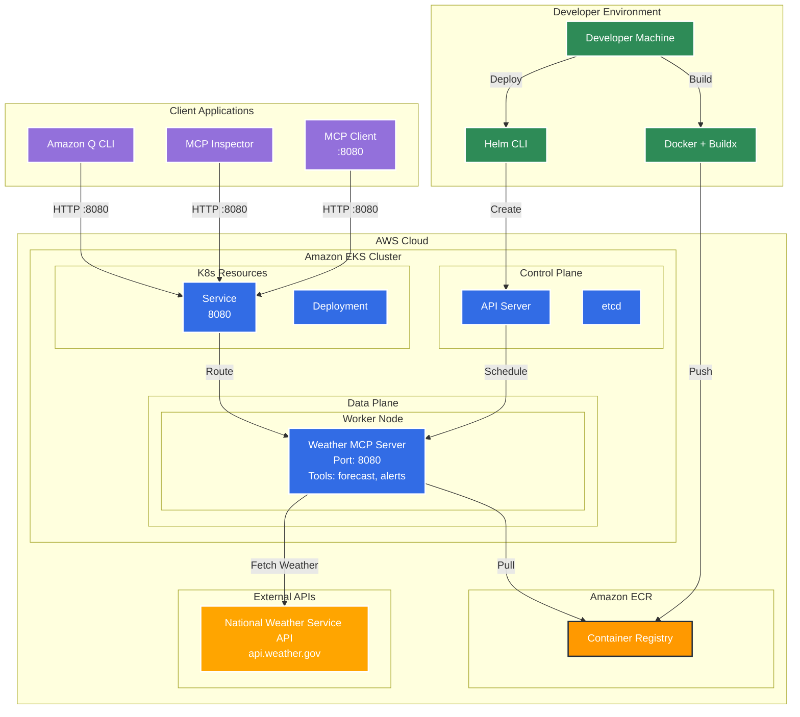

# Weather MCP Server on EKS

A weather forecasting MCP (Model Context Protocol) server that provides weather forecasts and alerts, deployed on Amazon EKS.

## Deploy your first MCP server on EKS

This tutorial will guide you through deploying the Weather MCP Server to Amazon EKS (Elastic Kubernetes Service) with multi-architecture support. Unlike AI agents that require Amazon Bedrock, this MCP server only needs internet access to fetch weather data from the National Weather Service API.

### Table of Contents

1. [Prerequisites](#prerequisites)
2. [Environment Setup](#environment-setup)
3. [Create EKS Cluster](#create-eks-cluster)
4. [Container Registry Setup](#container-registry-setup)
5. [Build and Push Multi-Architecture Image](#build-and-push-multi-architecture-image)
6. [Deploy to Kubernetes](#deploy-to-kubernetes)
7. [Verify Deployment](#verify-deployment)
8. [Access the MCP Server](#access-the-mcp-server)
9. [Clean Up Resources](#clean-up-resources)

---

### Architecture Overview

The following diagram shows the complete architecture of the Weather MCP Server deployment on Amazon EKS:



**Key Components:**

- **MCP Protocol**: Standardized interface for AI model communication via HTTP on port 8080
- **EKS Auto Mode**: Automatic node provisioning and management
- **No IAM Dependencies**: Simple deployment without complex permissions
- **Container Registry**: Stores the weather MCP server container image
- **External API Integration**: Fetches real-time weather data from National Weather Service

---

### Prerequisites

Before starting this tutorial, ensure you have the following tools installed:

- [AWS CLI](https://aws.amazon.com/cli/) (v2.0 or later)
- [eksctl](https://eksctl.io/) (v0.180.0 or later)
- [kubectl](https://kubernetes.io/docs/tasks/tools/) (v1.28 or later)
- [Docker](https://docs.docker.com/get-docker/) with buildx support
- [Helm](https://helm.sh/docs/intro/install/) (v3.0 or later)

**Required AWS Permissions:**
- EKS cluster creation and management
- ECR repository management

---

### Environment Setup

Set up the required environment variables for the deployment:

```bash
# AWS Configuration
export AWS_ACCOUNT_ID=$(aws sts get-caller-identity --query 'Account' --output text)
export AWS_REGION=us-west-2

# EKS Cluster Configuration
export CLUSTER_NAME=agentic-ai-on-eks

# Kubernetes Configuration
export KUBERNETES_APP_WEATHER_MCP_NAMESPACE=weather-mcp-server
export KUBERNETES_APP_WEATHER_MCP_NAME=weather-mcp-server
export KUBERNETES_APP_WEATHER_MCP_SERVICE_ACCOUNT=weather-mcp-server

# ECR Configuration
export ECR_REPO_NAME=mcp-servers/weather-mcp-server
export ECR_REPO_HOST=${AWS_ACCOUNT_ID}.dkr.ecr.${AWS_REGION}.amazonaws.com
export ECR_REPO_WEATHER_MCP_URI=${ECR_REPO_HOST}/${ECR_REPO_NAME}
```

---

### Create EKS Cluster

Create an EKS cluster with auto mode enabled for simplified management:

```bash
eksctl create cluster --name ${CLUSTER_NAME} --enable-auto-mode
```

This command will:
- Create a new EKS cluster with Kubernetes v1.32
- Enable EKS auto mode for automatic node provisioning
- Set up both AMD64 and ARM64 node support
- Configure the necessary VPC and networking
- Install essential add-ons like metrics-server

**Expected output:**
```
✔ EKS cluster "mcp-servers-on-eks" in "us-west-2" region is ready
```

Verify the cluster is running:
```bash
kubectl get pods -A
```

---

### Container Registry Setup

#### Step 1: Create ECR Repository

Create a private ECR repository for the weather MCP server image:

```bash
aws ecr create-repository --repository-name ${ECR_REPO_NAME}
```

#### Step 2: Authenticate Docker with ECR

Log in to your ECR registry:

```bash
aws ecr get-login-password --region ${AWS_REGION} | \
  docker login --username AWS --password-stdin ${ECR_REPO_HOST}
```

---

### Build and Push Multi-Architecture Image

#### Step 1: Set up Docker Buildx

Create and configure a multi-architecture builder:

```bash
docker buildx create --name multiarch --use
docker buildx use multiarch
```

#### Step 2: Build and Push Multi-Architecture Image

Build the image for both AMD64 and ARM64 architectures:

```bash
docker buildx build \
  --platform linux/amd64,linux/arm64 \
  -t ${ECR_REPO_WEATHER_MCP_URI}:latest \
  --push .
```

This command will:
- Build the image for both x86_64 and ARM64 architectures
- Create a multi-architecture manifest
- Push the image directly to ECR

#### Step 3: Verify Multi-Architecture Support

Confirm the image supports both architectures:

```bash
docker manifest inspect ${ECR_REPO_WEATHER_MCP_URI}:latest
```

You should see entries for both `linux/amd64` and `linux/arm64`.

---

### Deploy to Kubernetes

Deploy the weather MCP server using Helm:

```bash
helm upgrade ${KUBERNETES_APP_WEATHER_MCP_NAME} helm --install \
  --namespace ${KUBERNETES_APP_WEATHER_MCP_NAMESPACE} --create-namespace \
  --set serviceAccount.name=${KUBERNETES_APP_WEATHER_MCP_SERVICE_ACCOUNT} \
  --set image.repository=${ECR_REPO_WEATHER_MCP_URI} \
  --set image.pullPolicy=Always \
  --set image.tag=latest
```

This will:
- Create the necessary Kubernetes resources
- Deploy the weather MCP server
- Configure the MCP server to run on port 8080

---

### Verify Deployment

#### Step 1: Check Pod Status

Verify the pod is running successfully:

```bash
kubectl rollout status deployment/${KUBERNETES_APP_WEATHER_MCP_NAME}
kubectl get pods -l app.kubernetes.io/instance=${KUBERNETES_APP_WEATHER_MCP_NAME}
```
> **Note:** Takes 3 minutes to provision a new node

Expected output:
```
Waiting for deployment "weather-mcp-server" rollout to finish: 0 of 1 updated replicas are available...
NAME                                  READY   STATUS    RESTARTS   AGE
weather-mcp-server-xxxxxxxxx-xxxxx   1/1     Running   0          2m
```

#### Step 2: Check Application Logs

View the weather MCP server logs:

```bash
kubectl logs deployment/${KUBERNETES_APP_WEATHER_MCP_NAME}
```

You should see:
```
INFO:     Application startup complete.
INFO:     Uvicorn running on http://0.0.0.0:8080 (Press CTRL+C to quit)
```

#### Step 3: Verify Service

Check that the service endpoint is created:

```bash
kubectl get service ${KUBERNETES_APP_WEATHER_MCP_NAME}
kubectl get endpoints ${KUBERNETES_APP_WEATHER_MCP_NAME}
```

---

### Access the MCP Server

#### Port Forward (Development)

Forward the MCP server port to your local machine:

```bash
kubectl port-forward service/${KUBERNETES_APP_WEATHER_MCP_NAME} 8080:mcp
```

Now you can connect with MCP clients to `http://localhost:8080/mcp`.

#### Test with MCP Inspector

Use the MCP Inspector to test the connection:

```bash
npx @modelcontextprotocol/inspector
```

In the UI, use:
- **Transport:** streamable-http
- **URL:** `http://localhost:8080/mcp`

#### Test Available Tools

The weather MCP server provides these tools:

| Tool | Description | Parameters |
|------|-------------|------------|
| `weather___get_forecast` | Get weather forecast for a location | `location` (city, address, etc.) |
| `weather___get_alerts` | Get weather alerts for US states | `state` (2-letter code) |

#### Example Usage

Test the tools using the MCP Inspector:

1. **Get Weather Forecast:**
   - Tool: `weather___get_forecast`
   - Parameters: `{"location": "Seattle, Washington"}`

2. **Get Weather Alerts:**
   - Tool: `weather___get_alerts`
   - Parameters: `{"state": "CA"}`

---

### Clean Up Resources

When you're done with the tutorial, clean up the resources to avoid charges:

#### Step 1: Uninstall the Application

```bash
helm uninstall ${KUBERNETES_APP_WEATHER_MCP_NAME}
```

#### Step 2: Delete ECR Repository

```bash
aws ecr delete-repository --repository-name ${ECR_REPO_NAME} --force
```

#### Step 3: Delete EKS Cluster

```bash
eksctl delete cluster --name ${CLUSTER_NAME}
```

---

### Troubleshooting

| Issue | Solution |
|-------|----------|
| `exec format error` | Ensure you built a multi-architecture image with `--platform linux/amd64,linux/arm64` |
| Pod stuck in `CrashLoopBackOff` | Check logs with `kubectl logs <pod-name>` and verify network connectivity |
| Image pull errors | Verify ECR authentication and repository permissions |
| Health check failures | Check that the MCP server is running on port 8080 |
| Weather API errors | Verify internet connectivity from the pod |

### Next Steps

- Integrate the weather MCP server with Amazon Q CLI
- Set up monitoring and alerting for the deployment
- Configure ingress for external access
- Implement CI/CD pipelines for automated deployments
- Create additional MCP servers for other services

---

## Local Development

### Prerequisites

Ensure you have the following tools installed:

- Python 3.10 or higher
- [uv](https://docs.astral.sh/uv/) package manager

### Setup Instructions

#### 1. Install uv (if not already installed)

```bash
# On macOS and Linux
curl -LsSf https://astral.sh/uv/install.sh | sh

# On Windows
powershell -c "irm https://astral.sh/uv/install.ps1 | iex"

# Or via pip
pip install uv
```

#### 2. Create and Activate Virtual Environment

```bash
# Create a new virtual environment with uv
uv venv

# Activate the virtual environment
# On macOS/Linux:
source .venv/bin/activate

# On Windows:
.venv\Scripts\activate
```

#### 3. Install Dependencies

```bash
# Install the weather MCP server and its dependencies
uv sync
```

### Running the Server Locally

The weather MCP server supports two transport methods:

**Run with streamable-http transport (recommended for web integration):**
```bash
uv run mcp-server --transport streamable-http
```

**Run with stdio transport (for command-line integration):**
```bash
uv run mcp-server --transport stdio
```

**Use MCP Inspector to test the MCP server:**
```bash
npx @modelcontextprotocol/inspector
```

### Amazon Q Integration

#### 1. Configure MCP in Amazon Q

Create or update your Amazon Q MCP configuration file at `~/.config/amazonq/mcp.json`:

```json
{
  "mcpServers": {
    "weather": {
      "command": "uvx",
      "args": ["--from", ".", "--directory", "/path/to/weather-mcp-server", "mcp-server", "--transport", "stdio"]
    }
  }
}
```

**Note:** Replace `/path/to/weather-mcp-server` with the actual path to your weather MCP server directory.

#### 2. Restart Amazon Q

After updating the configuration, restart Amazon Q to load the new MCP server.

#### 3. Using Weather Tools in Amazon Q

Once connected, you can use the following weather-related commands in Amazon Q:

```
Get the weather forecast for Seattle, Washington
```

```
Are there any weather alerts for California?
```

```
Compare the weather between Miami, Florida and Denver, Colorado
```

### Running in a Container

#### Build the container using Docker:
```bash
docker build . --tag mcp-server
```

#### Build the container using Finch:
```bash
finch build . --tag mcp-server
```

#### Run the MCP server:
```bash
docker run -p 8080:8080 mcp-server
```

Connect your MCP client such as `npx @modelcontextprotocol/inspector` then in the UI use streamable-http with `http://localhost:8080/mcp`

-
