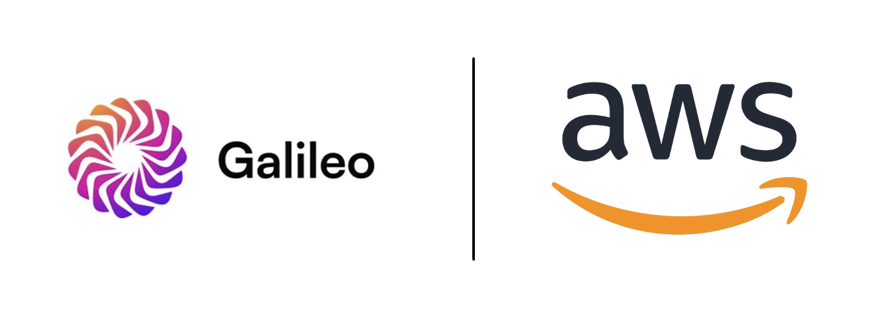
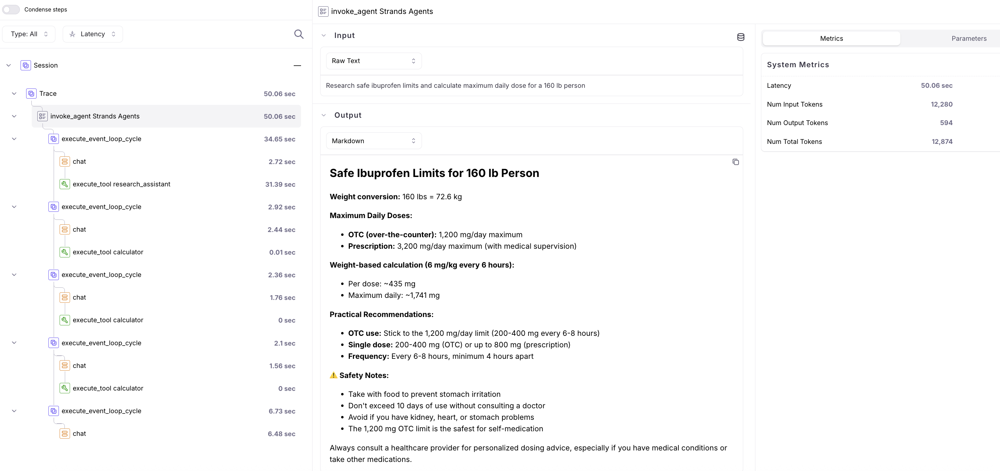

## Galileo 


Galileo is a cutting-edge evaluation and observability platform designed to empower developers building advanced generative AI solutions, such as RAG and AI agents. Traditional AI evaluation tools often fall short when dealing with the unpredictability of LLMs, making debugging of hallucinations notoriously challenging.

## Galileo Official Documentation

**Docs:** https://v2docs.galileo.ai/getting-started/quickstart

## Galileo + AWS

### Setup to log traces to Galileo
```python
pip install 'strands-agents[otel]' strands-agents-tools

import os
os.environ['OTEL_EXPORTER_OTLP_TRACES_ENDPOINT'] = "https://app.galileo.ai/api/galileo/otel/traces"

headers = {
    "Galileo-API-Key": 'YOUR_GALILEO_API_KEY',
    "project": 'YOUR_GALILEO_PROJECT',
    "logstream": 'YOUR_GALILEO_LOG_STREAM'
}
os.environ['OTEL_EXPORTER_OTLP_HEADERS'] = ",".join([f"{k}={v}" for k, v in headers.items()])

from strands.telemetry import StrandsTelemetry

strands_telemetry = StrandsTelemetry()
strands_telemetry.setup_otlp_exporter()
```

### Agents as Tools Demo
```python
from strands import Agent, tool
from strands_tools import use_llm, calculator, current_time

@tool
def research_assistant(query: str) -> str:
    research_agent = Agent(
        system_prompt="You are a research assistant. Give brief answers.",
        tools=[use_llm, calculator, current_time],
        trace_attributes={"agent.name": "Researcher"}
    )
    return str(research_agent(query))

orchestrator = Agent(
    system_prompt="Use research_assistant and calculator tools to answer queries. Keep answers brief.",
    tools=[research_assistant, calculator],
    trace_attributes={"agent.name": "Orchestrator"}
)

response = orchestrator("Research safe ibuprofen limits and calculate maximum daily dose for a 160 lb person")

```

### View traces on Galileo ###
[Galileo](https://app.galileo.ai/)


