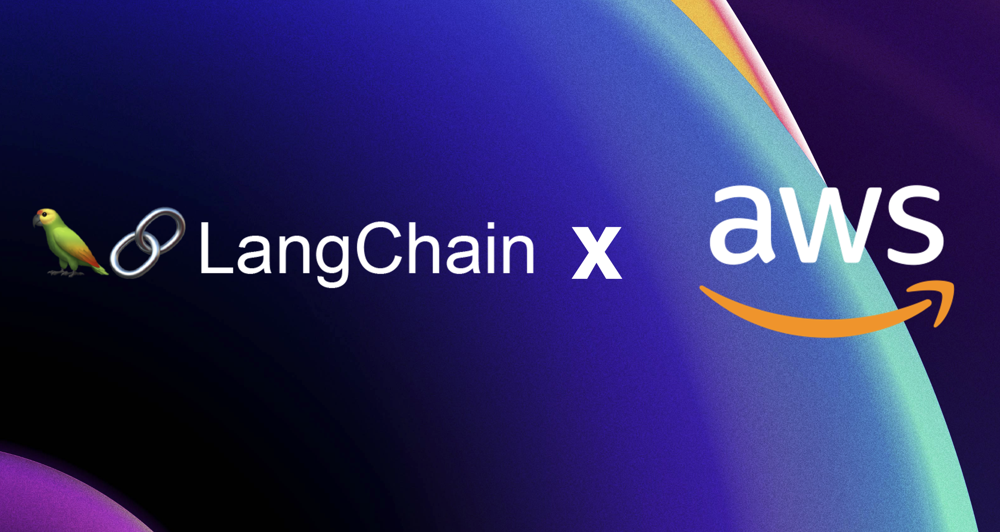

## LangChain


LangChain is a framework that helps facilitate the integration of large language models (LLMs) into applications. 

## LangChain Official Documentation

**Docs:** https://python.langchain.com/docs/introduction/

## LangChain + AWS

### Importing LLMs from Amazon Bedrock

**Model IDs Supported:** https://docs.aws.amazon.com/bedrock/latest/userguide/models-supported.html

**LLM Configuration:** 
Boto3:
```
from langchain_aws import BedrockLLM

llm = BedrockLLM(
    credentials_profile_name="bedrock-admin", model_id="amazon.titan-text-express-v1"
)

custom_llm = BedrockLLM(
    credentials_profile_name="bedrock-admin",
    provider="cohere",
    model_id="<Custom model ARN>",  # ARN like 'arn:aws:bedrock:...' obtained via provisioning the custom model
    model_kwargs={"temperature": 1},
    streaming=True,
)

custom_llm.invoke(input="What is the recipe of mayonnaise?")

```