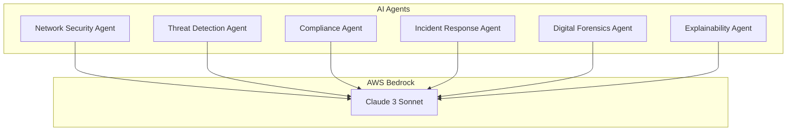
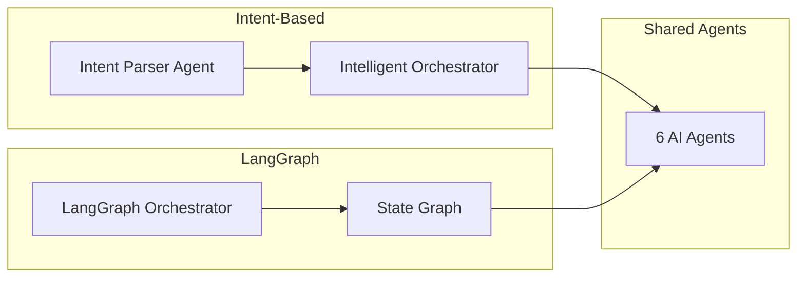
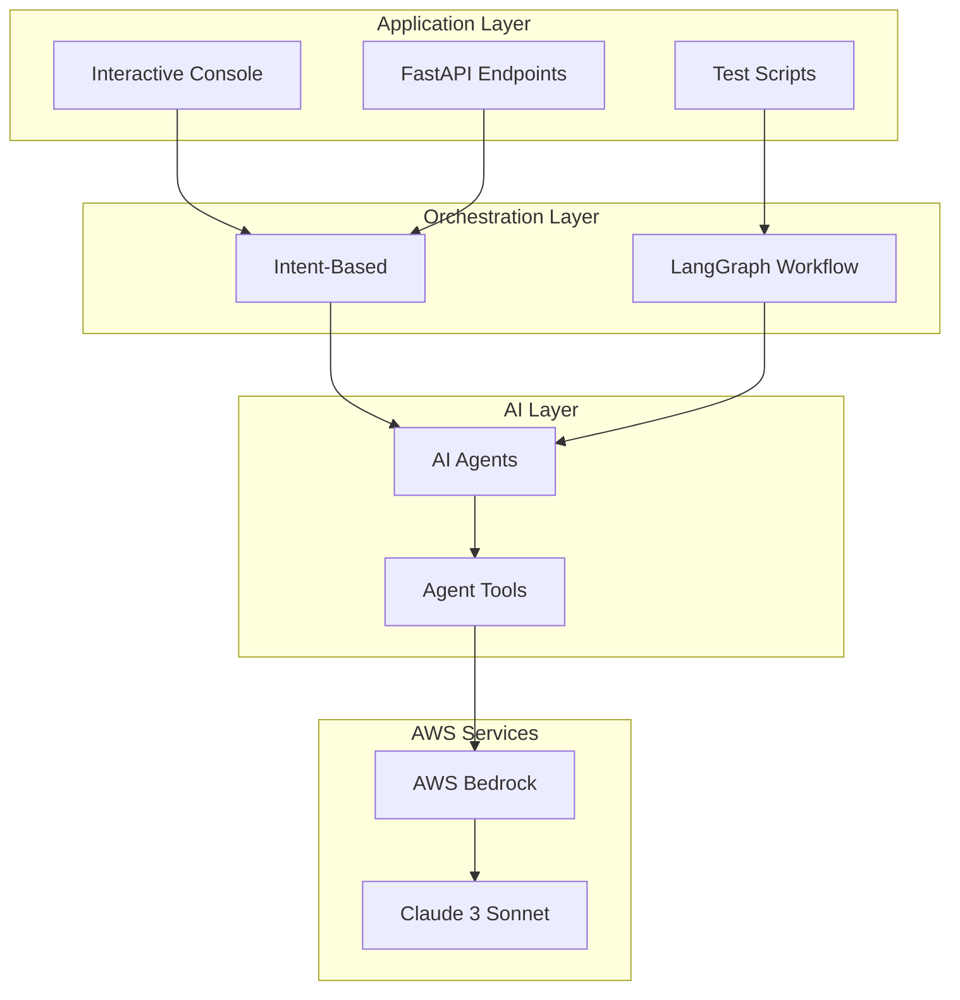
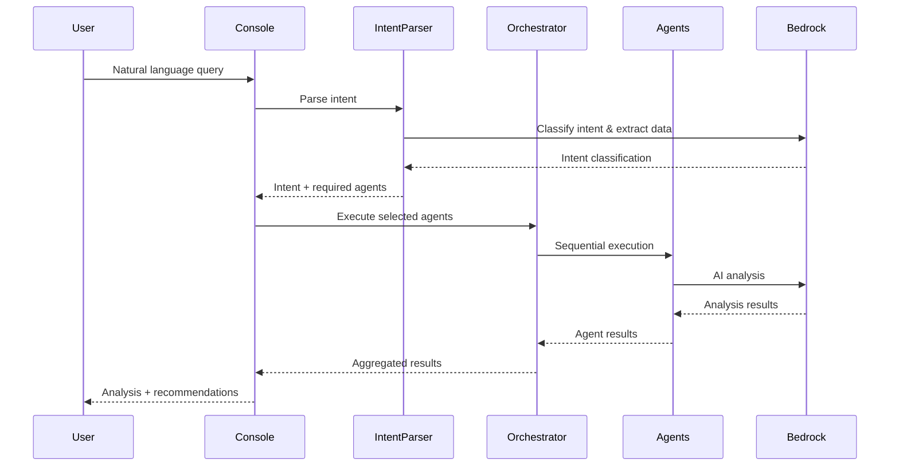
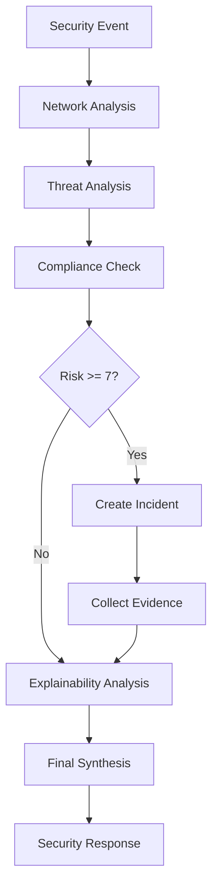
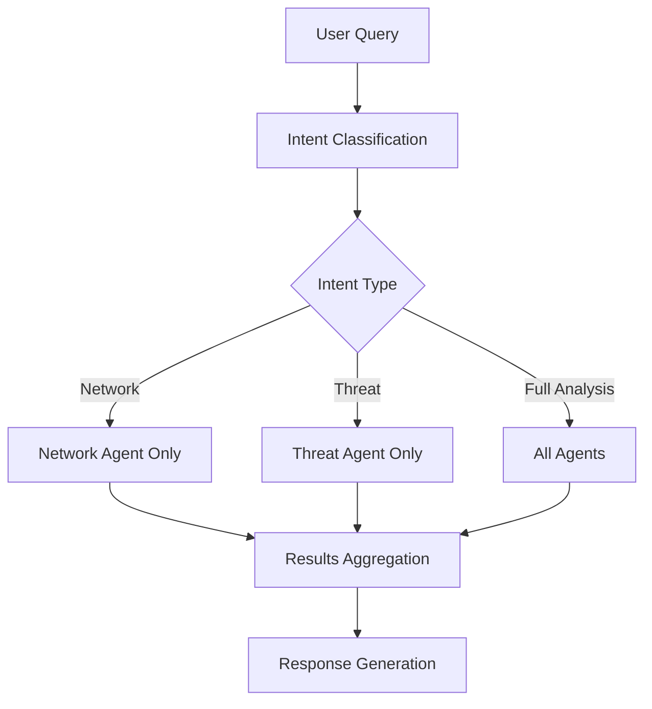
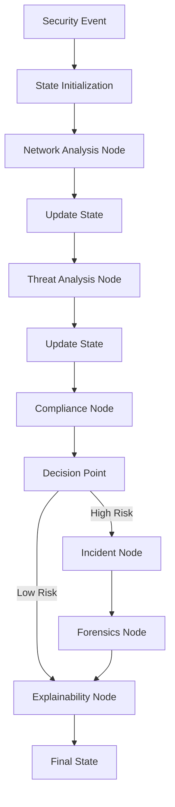

# Architecture Overview

This document provides a comprehensive overview of the Cybersecurity AI Platform architecture, covering both implementation approaches and their design decisions.

## 🏗️ System Architecture

The platform implements two distinct multi-agent orchestration patterns:

1. **Intent-Based Classification** - Natural language processing with selective agent execution
2. **LangGraph Workflows** - Graph-based state management with comprehensive analysis

Both approaches leverage the same core components and AI agents while providing different user experiences and execution patterns.

## 🧠 Core Components

### AI Agents Layer

Six specialized AI agents powered by AWS Bedrock Claude 3 Sonnet:



### Orchestration Layer

Two different orchestration approaches:



### Infrastructure Layer



## 🎯 Intent-Based Architecture

### Design Philosophy

The intent-based approach prioritizes efficiency and user experience by:
- Analyzing natural language queries to determine user intent
- Selectively executing only the necessary AI agents
- Providing real-time feedback and execution visibility
- Optimizing for interactive use cases

### Architecture Flow



### Key Components

#### Intent Parser Agent
```python
class IntentParserAgent:
    """
    Classifies user intent and determines required agents
    
    Tools:
    - classify_intent: Determine analysis type
    - determine_agents: Select required agents
    - extract_event_data: Parse structured data
    """
```

#### Intelligent Orchestrator
```python
class IntelligentOrchestrator:
    """
    Routes queries to appropriate agents based on intent
    
    Execution Patterns:
    - Selective: Run only required agents
    - Full: Run all agents for comprehensive analysis
    """
```

### Benefits
- **Efficiency**: 60-80% faster than full analysis
- **Cost Optimization**: 40-60% lower compute costs
- **User Experience**: Natural language interface
- **Error Resilience**: Agent failures don't cascade

## 🔄 LangGraph Architecture

### Design Philosophy

The LangGraph approach emphasizes comprehensive analysis and workflow orchestration by:
- Implementing state-based workflow management
- Ensuring complete security assessment coverage
- Providing structured data flow between agents
- Supporting complex conditional logic

### Architecture Flow



### State Management

```python
class SecurityState(TypedDict):
    event: Dict                 # Input security event
    network_analysis: Dict      # Network agent results
    threat_analysis: Dict       # Threat agent results
    compliance_analysis: Dict   # Compliance agent results
    incident_created: Dict      # Incident response results
    forensics_evidence: Dict    # Forensics collection results
    explainability_report: Dict # Decision explanations
    final_response: Dict        # Synthesized response
    next_action: str           # Workflow control
```

### Benefits
- **Comprehensive**: Always runs complete analysis
- **Structured**: Predictable workflow execution
- **Stateful**: Maintains context across agents
- **Scalable**: Supports complex workflow logic

## 🛠️ Agent Architecture

### Common Agent Pattern

All agents follow a consistent architecture pattern:

```python
class BaseAgent:
    def __init__(self):
        self.bedrock_client = BedrockLLMClient()
        self.agent = self._create_agent()
    
    async def analyze(self, event: Dict) -> Dict:
        """Main analysis method"""
        query = self._build_query(event)
        result = await asyncio.to_thread(self.agent.invoke, {"input": query})
        return self._process_result(result)
    
    def _create_agent(self):
        """Create LangChain AgentExecutor with tools"""
        tools = self._define_tools()
        system_prompt = self._get_system_prompt()
        return self.bedrock_client.create_agent(tools, system_prompt)
    
    def _define_tools(self) -> List[Tool]:
        """Define agent-specific tools"""
        pass
    
    def _get_system_prompt(self) -> str:
        """Define agent role and behavior"""
        pass
```

### Agent Specifications

#### Network Security Agent
```python
Tools:
- calculate_risk: Assess network risk scores
- identify_segments: Map network topology
- check_critical_asset: Verify asset criticality

Responsibilities:
- Network topology analysis
- Risk assessment and scoring
- Isolation recommendations
- Lateral movement analysis
```

#### Threat Detection Agent
```python
Tools:
- classify_threat: Categorize threat types
- calculate_severity: Score threat severity
- identify_attack_vector: Determine attack methods

Responsibilities:
- Threat classification and analysis
- IOC correlation and matching
- Attack pattern recognition
- Threat intelligence integration
```

#### Compliance Agent
```python
Tools:
- identify_violations: Detect policy violations
- calculate_compliance_risk: Assess regulatory impact
- get_affected_frameworks: Map to compliance frameworks

Responsibilities:
- Regulatory compliance assessment
- Policy violation detection
- Framework mapping (SOC2, PCI-DSS, NIST, ISO27001)
- Reporting requirements analysis
```

#### Incident Response Agent
```python
Tools:
- determine_severity: Classify incident severity
- assign_team: Route to response teams
- select_playbook: Choose response procedures

Responsibilities:
- Incident creation and management
- Response team coordination
- Playbook selection and execution
- Escalation procedures
```

#### Digital Forensics Agent
```python
Tools:
- identify_artifacts: Catalog digital evidence
- extract_indicators: Generate IOCs
- assess_attribution: Analyze threat actors

Responsibilities:
- Evidence collection planning
- Artifact identification and preservation
- IOC extraction and analysis
- Threat actor attribution
```

#### Explainability Agent
```python
Tools:
- generate_rationale: Explain decision logic
- justify_risk_scores: Detail scoring methodology
- explain_actions: Rationalize recommendations

Responsibilities:
- Decision transparency and explanation
- Risk score justification
- Audit trail generation
- Compliance documentation
```

## 🔧 Technical Implementation

### AWS Bedrock Integration

```python
class BedrockLLMClient:
    def __init__(self):
        self.bedrock_runtime = boto3.client(
            service_name='bedrock-runtime',
            region_name=os.environ.get('AWS_DEFAULT_REGION', 'us-east-1')
        )
    
    def create_agent(self, tools: List[Tool], system_prompt: str):
        llm = ChatBedrock(
            model_id="anthropic.claude-3-sonnet-20240229-v1:0",
            client=self.bedrock_runtime,
            model_kwargs={
                "max_tokens": 4000,
                "temperature": 0.1,
                "top_p": 0.9
            }
        )
        
        agent = create_react_agent(llm, tools, system_prompt)
        return AgentExecutor(
            agent=agent,
            tools=tools,
            verbose=True,
            handle_parsing_errors=True,
            max_iterations=5
        )
```

### Error Handling Strategy

```python
class ResilientAgent:
    async def analyze_with_retry(self, event: Dict, max_retries: int = 3) -> Dict:
        for attempt in range(max_retries):
            try:
                return await self.analyze(event)
            except Exception as e:
                if attempt == max_retries - 1:
                    return {"error": str(e), "agent": self.__class__.__name__}
                await asyncio.sleep(2 ** attempt)  # Exponential backoff
```

### Performance Optimization

```python
class OptimizedOrchestrator:
    def __init__(self):
        self.connection_pool = self._create_connection_pool()
        self.cache = TTLCache(maxsize=100, ttl=300)  # 5-minute cache
    
    async def process_with_caching(self, query: str) -> Dict:
        cache_key = hashlib.md5(query.encode()).hexdigest()
        if cache_key in self.cache:
            return self.cache[cache_key]
        
        result = await self.process_query(query)
        self.cache[cache_key] = result
        return result
```

## 📊 Data Flow Architecture

### Intent-Based Data Flow



### LangGraph Data Flow



## 🔒 Security Architecture

### Authentication & Authorization
- AWS IAM roles and policies
- Least privilege access principles
- Service-to-service authentication

### Data Protection
- Encryption in transit (TLS 1.3)
- Encryption at rest (AWS KMS)
- No persistent storage of sensitive data

### Audit & Compliance
- Complete decision audit trails
- CloudTrail API logging
- Compliance framework alignment

## 📈 Scalability Considerations

### Horizontal Scaling
- Stateless agent design
- Load balancer distribution
- Auto-scaling policies

### Performance Optimization
- Connection pooling
- Response caching
- Async processing
- Batch operations

### Cost Management
- Selective agent execution
- Request batching
- Model usage optimization
- Resource right-sizing

## 🔍 Monitoring & Observability

### Metrics Collection
```python
# Application metrics
- Agent execution time
- Success/failure rates
- Token usage per agent
- Query processing latency

# Infrastructure metrics
- CPU and memory utilization
- Network throughput
- Error rates
- Availability metrics
```

### Logging Strategy
```python
# Structured logging
{
    "timestamp": "2024-01-01T12:00:00Z",
    "level": "INFO",
    "agent": "network",
    "event_id": "evt-123",
    "source_ip": "192.168.1.45",
    "risk_score": 8,
    "execution_time_ms": 1250
}
```

## 🚀 Future Architecture Considerations

### Planned Enhancements
- Real-time streaming analysis
- Multi-tenant architecture
- Advanced caching strategies
- ML model fine-tuning
- Integration with SIEM/SOAR platforms

### Scalability Roadmap
- Kubernetes deployment
- Microservices decomposition
- Event-driven architecture
- Global deployment patterns

This architecture provides a robust foundation for enterprise cybersecurity analysis while maintaining flexibility for future enhancements and scaling requirements.