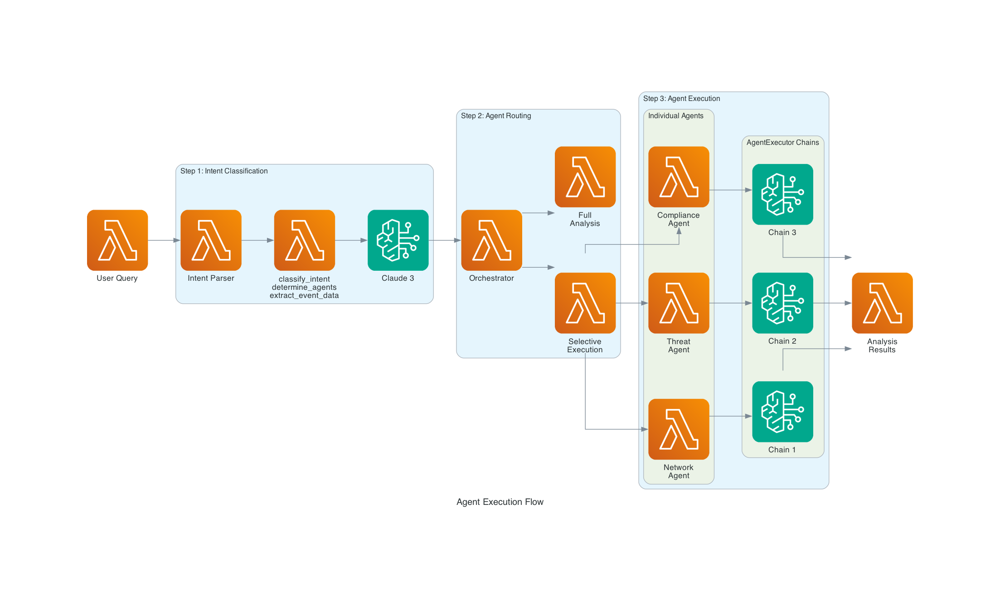

# Intent-Based Cybersecurity Analysis - Architecture Documentation

## 🏗️ System Architecture


### Architecture Overview

The Intent-Based Cybersecurity Analysis Platform uses a **sequential agent orchestration** approach with **natural language intent classification** to provide efficient and targeted security analysis.

## 🔄 Agent Execution Flow



### Execution Process

1. **Intent Classification** - Parse natural language query
2. **Agent Routing** - Determine which agents to execute
3. **Sequential Execution** - Run selected agents with AgentExecutor chains
4. **Results Aggregation** - Combine and present analysis results

## 🧠 AgentExecutor Chain Details

### Chain Architecture
Each security agent operates its own **LangChain AgentExecutor** chain:

```
User Query → Agent → Tools → Claude 3 Sonnet → Results
```

### 7 Independent AgentExecutor Chains

#### 1. Intent Parser Chain
- **Purpose**: Classify user intent and route to appropriate agents
- **Tools**: `classify_intent`, `determine_agents`, `extract_event_data`
- **Input**: Natural language security query
- **Output**: Intent type, required agents, structured event data

#### 2. Network Agent Chain
- **Purpose**: Assess network security impact and risks
- **Tools**: `calculate_risk`, `identify_segments`, `check_critical_asset`
- **Input**: Structured security event
- **Output**: Risk score, affected segments, isolation recommendations

#### 3. Threat Agent Chain
- **Purpose**: Analyze and classify security threats
- **Tools**: `classify_threat`, `calculate_severity`, `identify_attack_vector`
- **Input**: Security event details
- **Output**: Threat type, severity score, attack vector, confidence

#### 4. Compliance Agent Chain
- **Purpose**: Check compliance impact and violations
- **Tools**: `identify_violations`, `calculate_compliance_risk`, `get_affected_frameworks`
- **Input**: Security event context
- **Output**: Violations, compliance risk, affected frameworks

#### 5. Incident Agent Chain
- **Purpose**: Create and manage security incidents
- **Tools**: `determine_severity`, `assign_team`, `select_playbook`
- **Input**: Event severity and context
- **Output**: Incident ID, assigned team, response playbook

#### 6. Forensics Agent Chain
- **Purpose**: Collect and analyze digital evidence
- **Tools**: `identify_artifacts`, `extract_indicators`, `assess_attribution`
- **Input**: Security event data
- **Output**: Evidence artifacts, IOCs, threat attribution

#### 7. Explainability Agent Chain
- **Purpose**: Explain AI decisions and provide rationale
- **Tools**: `generate_rationale`, `justify_risk_scores`, `explain_actions`
- **Input**: Complete analysis results
- **Output**: Decision explanations, risk justifications, action rationale

## 🎯 Intent Classification Logic

### Intent Types and Agent Mapping

| Intent Type | Triggered Agents | Example Queries |
|-------------|------------------|-----------------|
| `network_analysis` | Network Agent | "Check network security for IP..." |
| `threat_analysis` | Threat Agent | "Analyze malware threat..." |
| `compliance_check` | Compliance Agent | "What are compliance implications..." |
| `incident_response` | Incident Agent | "Create incident for attack..." |
| `forensic_investigation` | Forensics Agent | "Collect evidence for..." |
| `explanation_request` | Explainability Agent | "Explain why risk score..." |
| `full_security_analysis` | All Agents | "Analyze critical security event..." |

### Pattern Matching Examples

```python
# Network Analysis Intent
"network", "firewall", "segment", "isolation" → network_analysis

# Threat Analysis Intent  
"threat", "malware", "attack", "vulnerability" → threat_analysis

# Compliance Check Intent
"compliance", "policy", "regulation", "audit" → compliance_check

# Full Analysis Intent
"analyze", "critical", "security event" → full_security_analysis
```

## 🔧 Technical Implementation

### Core Components

#### Intelligent Orchestrator
```python
class IntelligentOrchestrator:
    def __init__(self):
        self.intent_parser = IntentParserAgent()
        self.agents = {
            "network": NetworkSecurityAgent(),
            "threat": ThreatDetectionAgent(),
            "compliance": ComplianceAgent(),
            "incident": IncidentResponseAgent(),
            "forensics": ForensicsAgent(),
            "explainability": ExplainabilityAgent()
        }
```

#### Agent Creation Pattern
```python
def _create_agent(self):
    tools = [Tool(...), Tool(...), Tool(...)]
    system_prompt = "You are a [Agent Type] AI agent..."
    return self.bedrock_client.create_agent(tools, system_prompt)
```

#### Bedrock Client Integration
```python
def create_agent(self, tools: List[Tool], system_prompt: str):
    llm = ChatBedrock(model_id="anthropic.claude-3-sonnet-20240229-v1:0")
    agent = create_react_agent(llm, tools, system_prompt)
    return AgentExecutor(agent=agent, tools=tools)
```

## 🚀 Execution Patterns

### Selective Execution (Efficient)
- **Trigger**: Specific intent detected
- **Agents**: 1 agent only
- **Use Case**: Targeted analysis, quick queries
- **Example**: "Check network security" → Network Agent only

### Full Analysis (Comprehensive)
- **Trigger**: Complex security event or "analyze" keyword
- **Agents**: All 6 agents sequentially
- **Use Case**: Complete incident analysis
- **Example**: "Analyze critical SSH attack" → All agents

## 📊 Data Flow

### Input Processing
1. **Natural Language Query** → Intent Parser
2. **Intent Classification** → Agent Selection
3. **Event Extraction** → Structured Data

### Agent Execution
1. **Sequential Processing** → One agent at a time
2. **Independent Chains** → Isolated AgentExecutor instances
3. **Error Isolation** → Failed agents don't break workflow

### Output Generation
1. **Result Aggregation** → Combine agent outputs
2. **Risk Scoring** → Calculate overall risk
3. **Recommendations** → Generate action items

## 🛡️ Error Handling & Resilience

### Agent Isolation
- Each AgentExecutor runs independently
- Agent failures don't cascade to other agents
- Partial results still provide value

### Graceful Degradation
- Missing data handled with defaults
- Unknown values processed safely
- Workflow continues despite individual failures

### Recovery Mechanisms
- Retry logic for transient failures
- Fallback responses for critical errors
- Session history maintains context

## 🎯 Benefits of This Architecture

### Efficiency
- **Selective Execution** - Only run necessary agents
- **Resource Optimization** - Reduce compute costs
- **Faster Response** - Targeted analysis is quicker

### Flexibility
- **Natural Language** - Plain English queries
- **Intent-Driven** - Smart routing based on user needs
- **Extensible** - Easy to add new intents and agents

### Reliability
- **Error Isolation** - Agent failures contained
- **Predictable Flow** - Sequential execution is deterministic
- **Debugging** - Clear execution path visibility

### User Experience
- **Interactive Console** - Real-time feedback
- **Step Visibility** - See each agent execution
- **Natural Interface** - No complex syntax required

This architecture provides a robust, efficient, and user-friendly approach to cybersecurity analysis using AI agents with natural language processing.