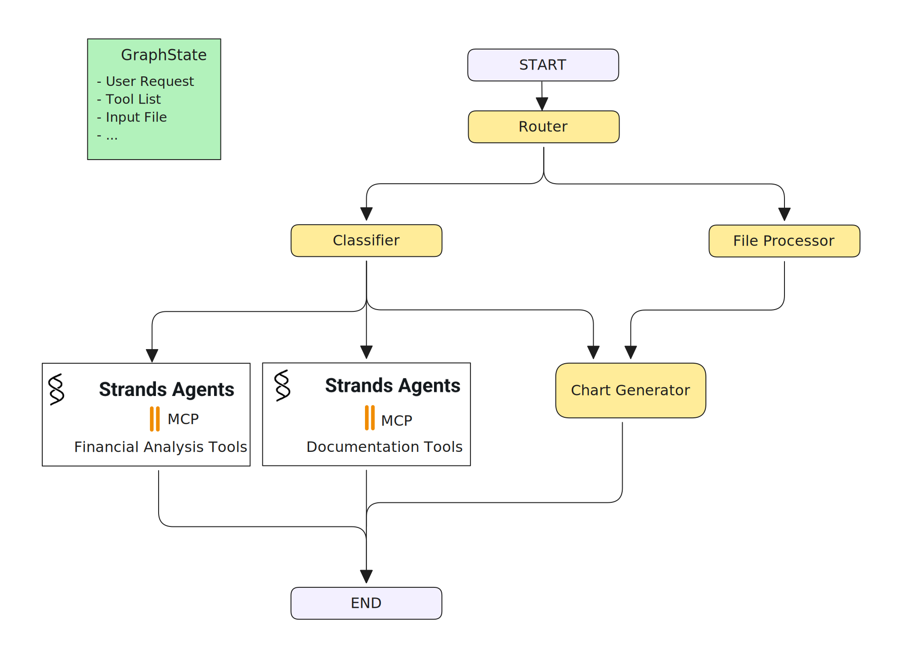
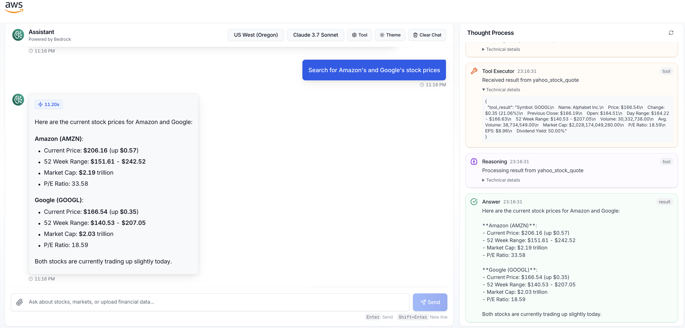

# Financial Analysis Agent

> An intelligent financial assistant powered by LangGraph, Strands Agent, and AWS Bedrock with MCP integration

<div align="left"></div>


## Overview

The Financial Analysis Agent is an AI-powered assistant designed to handle a wide range of financial requirements, document generation, and queries. Built on a hybrid architecture that combines LangGraph's structured workflow with Strands Agent framework and AWS Bedrock's powerful language models, this agent can analyze financial data, generate professional documents, provide insights, and assist with financial decision-making.

## Key Features

### Financial Domain Expertise
- Process and analyze financial requirements, stock data, market trends, and other financial information
- Generate financial reports and summaries
- Provide market insights and investment analysis
- Real-time stock quotes and historical data analysis

### Document Generation
- **Word Document Creation**: Generate professional Word documents with structured formatting
- **Financial Reports**: Create comprehensive financial analysis reports
- **Chart Integration**: Embed matplotlib-generated charts and visualizations in documents
- **Download Management**: Secure file download system with automatic cleanup

### Advanced AI Architecture
- **LangGraph + Strands Integration**: Combines LangGraph's workflow management with Strands Agent's tool orchestration
- **AWS Bedrock Integration**: Powered by Claude 3.7 Sonnet and other advanced language models
- **Streaming Responses**: Real-time thought process visibility with buffered reasoning display

### Modular MCP Integration
- **Expandable Functionality**: Standardized MCP (Model Context Protocol) tools for various domains
- **Financial Analysis Server**: Advanced financial calculations and analysis
- **Stock Market Server**: Real-time market data and historical analysis
- **Web News Server**: Financial news aggregation and sentiment analysis
- **Word Generator Server**: Professional document creation with charts
- **PDF Generator Server**: PDF document generation capabilities

### Interactive User Interface
- Clean, intuitive chat interface for natural conversation
- Real-time thought process panel showing agent reasoning
- Download buttons for generated documents
- MCP server management interface
- Theme support (light/dark mode)

## Architecture

The system architecture combines several key technologies:

### Why LangGraph?

LangGraph provides several advantages for this agent:

- **Modular Development**: Break down complex financial reasoning into manageable components
- **Intuitive Reasoning Flow**: Program the agent's thought process at the architectural level 
- **Structured Control Flow**: Direct how the agent approaches different financial questions
- **Recursive Processing**: Allow agents to recursively process financial information until reaching a satisfactory answer

### Agent Workflow

The agent employs a ReAct (Reasoning + Action) approach to solve financial queries:

1. Agent receives a financial question from the user
2. Using LangGraph, it structures its reasoning about how to approach the problem
3. It determines what tools might be needed to answer the query
4. It dynamically accesses the necessary MCP tools using a standardized protocol
5. It processes the information recursively, going back to reasoning when needed
6. It presents a comprehensive answer to the user

### MCP Tool Integration

The agent can be extended with various MCP tools for different financial domains:

- **Financial Analysis Tools**: Ratio analysis, trend evaluation, financial statement analysis
- **Stock Market Tools**: Real-time quotes, historical data, technical indicators
- **News Analysis**: Financial news sentiment, market impact predictions
- **Portfolio Management**: Asset allocation, risk assessment, diversification analysis

To add a new MCP server:

1. Click on the settings icon in the UI
2. Enter server name and hostname in the MCP Server Settings dialog
3. Click "Add and Test Server" to validate the connection


<div align="left"></div>


## Installation

### Prerequisites

- Node.js (version 18+)
- Python 3.10+
- AWS account with Bedrock access

### Setup

1. Clone the repository:

```bash
git clone https://github.com/3P-Agentic-Frameworks.git
cd 3P-Agentic-Frameworks/langgraph/financial-agent
```

2. Set up Python virtual environment:

```bash
# Create virtual environment
python -m venv .venv

# Activate virtual environment
source .venv/bin/activate
```

3. Install frontend dependencies:

```bash
npm install
```

4. Install backend dependencies:

```bash
cd py-backend
pip install -r requirements.txt
```

## Usage

1. Start the development server:

```bash
npm run dev
```

This command will start both the Next.js frontend and the Python backend servers.

2. Open your browser to `http://localhost:3000`

3. Use the chat interface to ask financial questions

4. Configure MCP servers via the settings panel to extend functionality

<div align="left"></div>

<div align="left"></div>

<div align="left"></div>

## Project Structure

```
financial-agent/
├── app/                # Next.js app directory
├── components/         # React components
├── hooks/             # Custom React hooks
├── lib/               # Utility functions
├── public/            # Static assets
├── py-backend/        # Python backend with FastAPI
│   ├── app/           # Backend application code
│   └── requirements.txt  # Python dependencies
├── utils/             # Frontend utilities
└── README.md          # Project documentation
```

