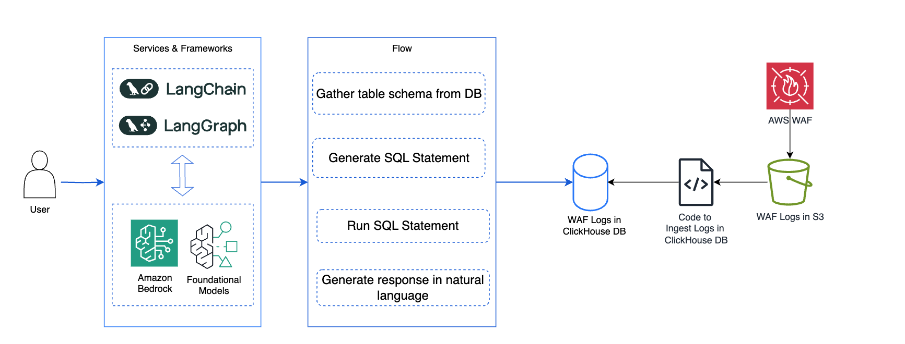

# Analyse AWS WAF logs with natural language
This sample demonstrates ingesting WAF logs in Clickhouse database and searching these using natural language.

## Architecture




## Pre-requisites
You need to configure Clickhouse DB configuration parameters in `.env` file. 

```
CLICKHOUSE_HOST=
CLICKHOUSE_USER=
CLICKHOUSE_PASSWORD=
CLICKHOUSE_PORT=
CLICKHOUSE_SECURE=
CLICKHOUSE_VERIFY=true
CLICKHOUSE_CONNECT_TIMEOUT=60
CLICKHOUSE_SEND_RECEIVE_TIMEOUT=60
CLICKHOUSE_DATABASE=default
```
Refer to Clickhouse documentation for details of these parameters.

## Usage

Ingest WAF Logs data from S3 bucket to Clickhouse database. 
```
python s3_to_clickhouse
```
Data gets imported in `waf_logs` table in `default` database.

Run application
```
python main.py
```
