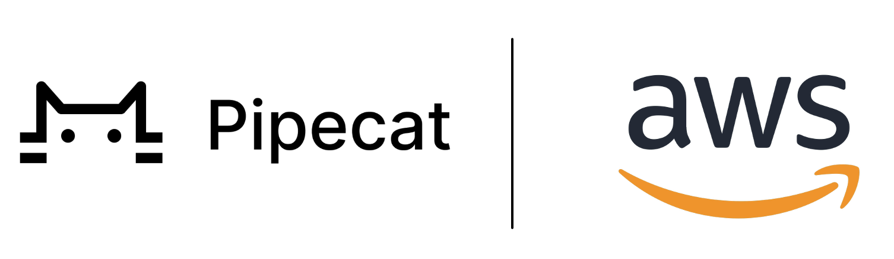

## Pipecat 


Pipecat is an open-source Python framework for building real-time voice and multimodal conversational agents. Orchestrate audio and video, AI services, different transports, and conversation pipelines effortlessly—so you can focus on what makes your agent unique. 

## Pipecat Official Documentation

**Docs:** https://docs.pipecat.ai/getting-started/overview

## Pipecat + AWS
Pipecat supports Amazon Nova Sonic models out of the box. Here is how to get started:

```python
pip install "pipecat-ai[aws-nova-sonic]"

from pipecat.services.aws_nova_sonic.aws import AWSNovaSonicLLMService

llm = AWSNovaSonicLLMService(
    secret_access_key=os.getenv("AWS_SECRET_ACCESS_KEY"),
    access_key_id=os.getenv("AWS_ACCESS_KEY_ID"),
    region=os.getenv("AWS_REGION")
    voice_id="tiffany",                    # Voices: matthew, tiffany, amy
)
```
