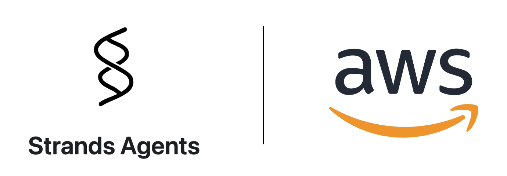

## Strands Agents 


Strands Agents is a simple-to-use, code-first framework for building agents. This repo will capture strands integrations with 3P agentic frameworks. To view more samples with Strands Agents, please goto: https://github.com/strands-agents/samples 

## Strands Agents Official Documentation

**Docs:** https://strandsagents.com/latest/

**Strands Configuration:** 

```python
pip install strands-agents

from strands import Agent

# Create an agent with default settings
agent = Agent()

# Ask the agent a question
agent("Tell me about agentic AI")
```
