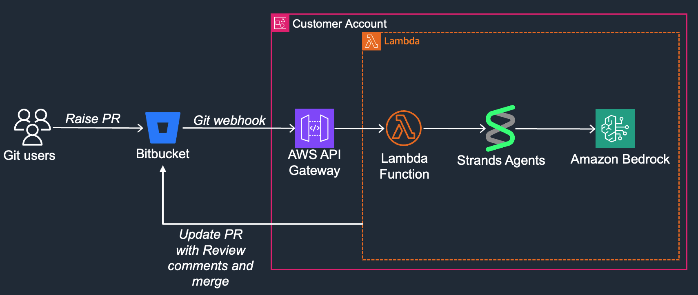

# Bitbucket PR Review Agent

An intelligent AWS Lambda-based agent that automatically reviews pull requests in Bitbucket repositories using AI-powered code analysis. This agent leverages the Strands framework and Amazon Bedrock's Claude model to provide comprehensive code reviews, automated feedback, and smart merge decisions.

## Features

- **Automated PR Analysis**: Analyzes pull request titles, descriptions, and code diffs
- **AI-Powered Code Review**: Uses Claude Sonnet 4 via Amazon Bedrock for intelligent code analysis
- **Quality Standards Enforcement**: Checks for PEP 8 compliance, code correctness, performance, and security
- **Automated Actions**: Can approve, comment, and merge pull requests based on review results
- **Bitbucket Integration**: Seamless integration with Bitbucket Cloud API
- **Serverless Architecture**: Built on AWS Lambda for scalable, event-driven processing

## Architecture



The solution consists of three main components:

1. **Lambda Function** (`lambda_function.py`): Main entry point that processes Bitbucket webhook events
2. **PR Agent** (`pr_agent.py`): AI-powered agent using Strands framework for code analysis
3. **PR Handler** (`pr_handler.py`): Bitbucket API integration for PR operations

## Prerequisites

- AWS Account with Lambda and Bedrock access
- Bitbucket Cloud account with API access
- Python 3.13 runtime environment
- Strands Agents SDK
- Bitbucket webhook configuration ([Setup Guide](https://support.atlassian.com/bitbucket-cloud/docs/manage-webhooks/))

## Installation

### 1. Clone the Repository

```bash
git clone <repository-url>
cd bitbucket-pr-review-agent
```

### 2. Create Lambda Layer

The project includes a script to build the required Lambda layer with dependencies:

```bash
cd lambda-layer
chmod +x build-layers.sh
./build-layers.sh
```

**Note**: Update the following variables in `build-layers.sh` before running:
- `bucket_name`: Your S3 bucket name for storing the layer
- `layer_name`: Desired name for the Lambda layer
- `layer_description`: Description for the layer

### 3. Configure Bitbucket Access

Update the `ACCESS_TOKEN` in `lambda/pr_handler.py`:

```python
ACCESS_TOKEN = "your-bitbucket-access-token"
```

### 4. Deploy Lambda Function

1. Create a new Lambda function in AWS Console
2. Set runtime to Python 3.13
3. Set architecture to arm64
4. Upload the code from the `lambda/` directory
5. Attach the created Lambda layer
6. Configure appropriate IAM permissions for Bedrock access
7. Create an API Gateway to expose the Lambda function ([Tutorial](https://docs.aws.amazon.com/lambda/latest/dg/services-apigateway-tutorial.html))

### 5. Configure Bitbucket Webhook

Set up a webhook in your Bitbucket repository:
- **URL**: Your API Gateway endpoint URL
- **Events**: Pull request created, updated
- **Active**: Yes

## Configuration

### Environment Variables

Set the following environment variables in your Lambda function:

```
MODEL_ID=apac.anthropic.claude-sonnet-4-20250514-v1:0
```

### IAM Permissions

Ensure your Lambda execution role has the following permissions:

```json
{
    "Version": "2012-10-17",
    "Statement": [
        {
            "Effect": "Allow",
            "Action": [
                "bedrock:InvokeModel"
            ],
            "Resource": "arn:aws:bedrock:*:*:foundation-model/anthropic.claude*"
        }
    ]
}
```

## Usage

Once deployed and configured, the agent will automatically:

1. **Receive Webhook Events**: Listen for PR creation/update events from Bitbucket
2. **Analyze Code Changes**: Extract and analyze the PR diff using AI
3. **Generate Review Comments**: Provide detailed feedback based on code quality standards
4. **Make Decisions**: Automatically approve and merge PRs that meet quality standards

### Review Criteria

The agent evaluates PRs based on:

- **Readability & Style**: PEP 8 compliance, naming conventions, code structure
- **Correctness**: Logic errors, edge cases, error handling
- **Performance**: Efficient algorithms and data structures
- **Maintainability**: Modularity, code duplication, testability
- **Security**: Potential vulnerabilities and security best practices

## API Response Format

The agent returns structured JSON responses:

```json
{
    "review_comments": "Detailed review feedback and suggestions",
    "approve": true/false
}
```

## Customization

### Modifying Review Standards

Update the `SYSTEM_PROMPT` in `pr_agent.py` to customize review criteria:

```python
SYSTEM_PROMPT = '''
Your custom review instructions here...
'''
```

### Changing AI Model

Update the `MODEL_ID` in `pr_agent.py` to use different Bedrock models:

```python
MODEL_ID = 'your-preferred-model-id'
```

## Troubleshooting

### Common Issues

1. **Authentication Errors**: Verify Bitbucket access token permissions
2. **Bedrock Access**: Ensure proper IAM permissions for Bedrock
3. **Layer Dependencies**: Rebuild layer if encountering import errors
4. **Webhook Failures**: Check Lambda function logs and Bitbucket webhook delivery logs

### Logging

The function includes comprehensive logging. Check CloudWatch logs for debugging:

```python
logger.info(f'input payload -->\n{event}')
logger.info(f'Agent response: {response}')
```


## Dependencies

- **strands-agents**: AI agent framework
- **requests**: HTTP library for API calls
- **boto3**: AWS SDK (included in Lambda runtime)
- **json**: JSON processing (built-in)
- **re**: Regular expressions (built-in)

## API References

- [Bitbucket Pull Requests API](https://developer.atlassian.com/cloud/bitbucket/rest/api-group-pullrequests/#api-group-pullrequests) - Complete documentation for Bitbucket Cloud Pull Request APIs

## Security Considerations

- Store sensitive tokens in AWS Secrets Manager or environment variables
- Use least-privilege IAM policies
- Enable CloudTrail logging for audit trails
- Regularly rotate access tokens
- Monitor Lambda function invocations and costs