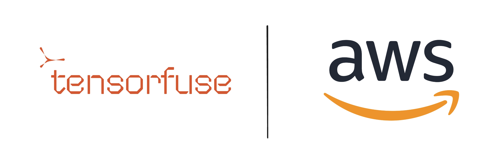

## Tensorfuse 


Tensorfuse is a serverless GPU runtime that lets you run fast, scalable AI inference in your own AWS VPC. Deploy any custom or open-source model using any inference server (vLLM, TensorRT, or Dynamo), and access it via an OpenAI-compatible API for use in your agents and AI apps.

Under the hood, we provision an EKS cluster optimized for running AI workloads in your AWS. The cluster acts as a control plane for all your deployments and CI/CD - allowing you to scale with zero infra overhead.


## Tensorfuse Official Documentation

**Docs:** https://tensorfuse.io/docs/concepts/introduction

## Tensorfuse + AWS

### [Deploy production ready LLM service using vLLM (Llama-70b)](deploy-llama70b-on-eks)
In this guide, we will walk you through the process of deploying Llama 3.3 70B Instruct model using Tensorfuse on your AWS. We will use the vLLM image maintained by Tensorfuse and patched for performance and security issues.

We will be using 4xL40S GPUs to deploy the model and at the end, you will get an OpenAI compatible endpoint to use in your agents. 


### Integrating Tensorfuse endpoints with popular Agent frameworks

**CrewAI Configuration:** 

Once you deploy the model using Tensorfuse, you will get an OpenAI compatible endpoint that looks like this:

```bash
<YOUR_APP_URL>/v1
```

Follow the steps below to integrate it with CrewAI Agents:

###### 1. Navigate to the ```crew.py``` file inside the your CrewAI project
###### 2. The **LLM function** in the Crew AI library is powered by LiteLLM LLM gateway. Import this function inside your ```crew.py``` file as follows: ```from crewai import LLM```
###### 3. We will then define a custom LLM using the endpoint and API key we get from Tensorfuse. You just need to add the following code snippet inside your ```crew.py``` file:


```python
custom_llm = LLM(
    model="openai/meta-llama/Llama-3.3-70B-Instruct",
    base_url="<YOUR_APP_URL>/v1",  # model hosted on EKS via Tensorfuse
    max_tokens=512,
    api_key="YOUR_API_KEY"
)
```

Note: We will have to add ```openai``` prefix in the model name because that's how [LiteLLM knows to route requests to OpenAI](https://docs.litellm.ai/docs/providers/openai_compatible) 

And that's it! You have successfully integrated self-hosted model using Tensorfuse into your Crew AI agents 🚀